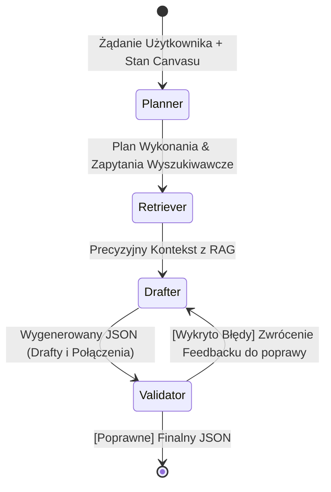

# Architektura Meta-Agenta V2 (Przepływ LangGraph)

Ten dokument opisuje nowy, zaawansowany proces wykonawczy (pipeline) Meta-Agenta w systemie Axon, który został przebudowany w oparciu o graf stanowy (Agentic Workflow) przy użyciu biblioteki LangGraph.

W przeciwieństwie do starszej wersji (V1), która polegała na jednym, masywnym zapytaniu do modelu językowego ("Mega-Prompt"), architektura V2 dekomponuje proces wnioskowania, wyszukiwania kontekstu, generowania danych oraz walidacji na odseparowane, niezależne węzły (Nodes) wchodzące w skład maszyny stanowej.

---

## 🗺️ Wysokopoziomowa Topologia Grafu



---

## 📦 Globalny Stan (Obiekt `MetaAgentState`)

Podczas przetwarzania żądania, dane przepływają przez graf i modyfikują centralny obiekt stanu. Gwarantuje to pełną hermetyzację – każdy węzeł ma dostęp wyłącznie do tych informacji, których aktualnie potrzebuje do wykonania swojego zadania.

```python
class MetaAgentState(TypedDict):
    messages: Annotated[List[BaseMessage], add_messages] # Historia dialogu (wykorzystywana w pętlach korekcyjnych)
    request: MetaAgentProposalRequest                    # Oryginalne żądanie od użytkownika (w tym załączniki)
    canvas_state: Dict[str, Any]                         # Bieżąca topologia węzłów na graficznym interfejsie Canvasu
    plan: str                                            # Wysokopoziomowy plan działania wygenerowany przez LLM
    search_queries: List[str]                            # Zoptymalizowane słowa kluczowe dla bazy wektorowej (RAG)
    rag_context: str                                     # Sformatowane wyniki z bazy wektorowej
    draft_response: MetaAgentProposalResponse            # Finalnie wygenerowana odpowiedź (Drafty)
    validation_errors: List[str]                         # Błędy logiki biznesowej wykryte przez walidator
    iteration_count: int                                 # Licznik pętli (zabezpieczenie przed nieskończonym działaniem)
```

---

## ⚙️ Szczegóły Wykonawcze Poszczególnych Węzłów (Nodes)

### 1. Węzeł Planisty (Planner Node) 🧠
**Typ:** Obsługiwany przez LLM (Szybki/Tani Model, np. GPT-4o-mini)
**Cel:** Zrozumienie intencji użytkownika (*co* trzeba zrobić), zanim system przystąpi do generowania skomplikowanych struktur JSON.

- **Wejście:** `request.query` (zapytanie), `canvas_state` (stan Canvasu)
- **Proces:** LLM analizuje prośbę użytkownika w oparciu o to, co już znajduje się na Canvasie. Zamiast pisać kod czy tworzyć JSON-y, tworzy wysokopoziomowy plan (np. "1. Potrzebujemy narzędzia Web Scraper. 2. Potrzebujemy Agenta, który go użyje. 3. Łączymy ich.") oraz wyodrębnia listę kluczowych fraz do wyszukiwania w bazie (`search_queries`), np. `["web scraper tool", "data gathering templates"]`.
- **Wyjście:** Aktualizacja zmiennych `plan` oraz `search_queries` w stanie grafu.

### 2. Węzeł Celowego Wyszukiwania (Targeted Retriever Node) 🔍
**Typ:** Czysty Python (Wyszukiwanie w Bazie Wektorowej, 0 kosztów LLM)
**Cel:** Pobranie precyzyjnego kontekstu z systemu, bez zanieczyszczania promptu nieistotnymi danymi.

- **Wejście:** `search_queries`
- **Proces:** Równoległe, asynchroniczne odpytanie dwóch baz wektorowych: **RAG#1 (Baza Wiedzy)** oraz **RAG#2 (Świadomość Systemu/Istniejące Encje)**. Zamiast wyszukiwać na podstawie surowego, często chaotycznego zapytania użytkownika, system używa zoptymalizowanych fraz od Planisty.
- **Wyjście:** Aktualizacja `rag_context` (sformatowany, przyjazny dla LLM string zawierający tylko pasujące dokumenty i encje systemowe).

### 3. Węzeł Projektanta (Drafter Node) 🏗️
**Typ:** Obsługiwany przez LLM (Model Ekspercki, np. GPT-4o) + Ustrukturyzowane Wyjście Pydantic
**Cel:** Wygenerowanie ścisłej, gotowej do użycia struktury JSON dla interfejsu Space Canvas.

- **Wejście:** `plan`, `rag_context`, `canvas_state`, oraz `validation_errors` (jeśli graf znajduje się w pętli poprawkowej).
- **Proces:** Model otrzymuje prompt systemowy, wyraźny plan działania, kontekst, z którego może skorzystać, oraz stan Canvasu, do którego musi się podłączyć. Używa natywnej funkcji LangChain `.with_structured_output(MetaAgentProposalResponse)`, co na poziomie API wymusza zwrot idealnego obiektu zgodnego ze schematem Pydantic. Mechanizm ten całkowicie eliminuje potrzebę "wycinania" JSON-a za pomocą wyrażeń regularnych (Regex).
- **Wyjście:** Zapisuje wynik do `draft_response` i zwiększa `iteration_count`.

### 4. Węzeł Walidatora (Validator Node) 🛡️
**Typ:** Czysty Python (0 kosztów LLM)
**Cel:** Bezkosztowa weryfikacja logiki biznesowej i reguł topologii grafu.

- **Wejście:** `draft_response`, `canvas_state`
- **Proces:**
  1. Sprawdza, czy wszystkie zaproponowane strefy docelowe (`target_workspace`) są poprawne.
  2. Weryfikuje proponowane połączenia (krawędzie grafu): Czy źródło połączenia (`source_draft_name`) istnieje w nowo utworzonych draftach LUB znajduje się już fizycznie na Canvasie (`canvas_state`)? Czy cel połączenia (`target_draft_name`) istnieje?
  3. Wykrywa naruszenia reguł izolacji stref (zabronione są bezpośrednie połączenia między różnymi strefami/zones).
- **Wyjście:** Aktualizuje `validation_errors` (zwraca pustą listę, jeśli wszystko jest poprawne, lub tworzy listę konkretnych, czytelnych błędów dla Projektanta).

---

## 🔄 Krawędź Warunkowa (Pętla Refleksji / Samo-korekty)

Po zakończeniu pracy Walidatora, **Krawędź Warunkowa (Conditional Edge)** podejmuje decyzję o kolejnym kroku na podstawie zawartości stanu:

- **Jeśli `validation_errors` jest PUSTE:** Cykl dobiega końca. System uznaje wygenerowany JSON za bezbłędny i zwraca `draft_response` do frontendu.
- **Jeśli `validation_errors` NIE JEST PUSTE, a `iteration_count` < 3:** Następuje zawrócenie (loop) strumienia danych do węzła **Drafter (Projektant)**. LLM otrzymuje swój poprzedni, błędny JSON wraz z listą konkretnych uwag (np. *"Błąd: Zaproponowałeś połączenie z 'Agentem X', ale taki węzeł nie istnieje ani w Twoich projektach, ani na Canvasie."*) i zostaje poproszony o poprawienie struktury.
- **Jeśli `iteration_count` >= 3:** Pętla zostaje brutalnie przerwana, aby zapobiec nieskończonemu zużyciu zasobów (i kosztów API). System przerywa działanie i zwraca najlepszy (ostatni) wynik do frontendu, logując ostrzeżenie po stronie backendu.

---

## 🎯 Główne Zyski względem V1 (Architektury Mega-Promptu)
- **Separacja Odpowiedzialności (Separation of Concerns):** Procesy planowania, pobierania kontekstu i generowania struktury nie "walczą" już ze sobą w ramach jednego ogromnego promptu.
- **Darmowa Weryfikacja (Zero-Token Verification):** Walidator wyłapuje błędy strukturalne i topologiczne czystym kodem, co pozwala zaoszczędzić tysiące tokenów na weryfikacji.
- **Zdolność Samoleczenia (Self-Healing):** System potrafi automatycznie zidentyfikować i naprawić własne halucynacje (np. odniesienia do nieistniejących węzłów), zanim użytkownik w ogóle je zobaczy.
- **Ścisłe Wymuszanie Schematu (Schema Enforcement):** Natywna integracja wymuszająca określony typ zwracanych obiektów (Function/Tool Calling) pozwala całkowicie zrezygnować z kruchego parsowania tekstu.