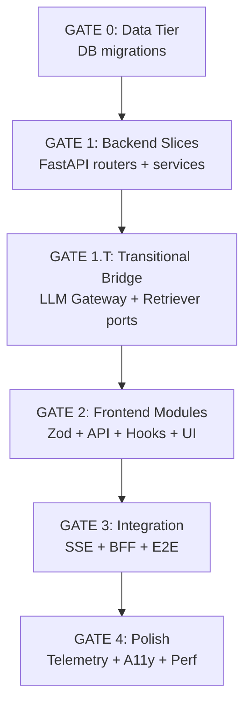

# 🛠️ IMPLEMENTATION PLAN
> **File:** `Docs/IMPLEMENTATION.md`
> **Generated from:** `Docs/PRP.md` & `knowledge/tech/*`
> **Last Updated:** 2026-02-17

---

## 🧠 Memory & Context Check
Before starting, I have reviewed `knowledge/memory.md` and applied the following relevant lessons:
- [x] **uv dependency**: Using `uv add` and ensuring `pyproject.toml` compatibility.
- [x] **CRITICAL KNOWLEDGE PROTOCOL**: Strictly following `knowledge/tech/*` and `knowledge/structure/*`.
- [x] **CRITICAL TESTING PROTOCOL**: Running tests after significant changes.
- [x] **CRITICAL DOCS PROTOCOL**: Updating Tech & Non-Tech docs.

---

## 📚 Context & Sources (Grounding)
> **Mandatory:** List specific Global Context files used as the source of truth for this plan.

- **Tech PRD:** `docs/tech_prd_axon_v2.md`
- **ARD:** `docs/ard_axon_v2.md`
- **PRP:** `docs/PRP.md`
- **Traceability Matrix:** `docs/implementation/traceability_matrix_vNext.md`
- **Architecture:** `docs/knowledge/structure/python-fastapi-ddd.md` (Backend), `docs/knowledge/structure/modular-monolith-nextjs.md` (Frontend)

---

## 🔎 Legend (Glossary)
- DB: Database (schemat/migracje/indeksy)
- BE: Backend (FastAPI modules, Inngest)
- FE: Frontend (Next.js modules/UI)
- FEv: Frontend View (konkretny route/page)
Tags in checklist: [Auth/RLS], [404/403], [Filters], [Search], [Sort], [Tabs], [Modal], [Anchor], [SSE], [Debugger]

---

## 🔗 References (specs only, no duplication)
- **Data Models (SSOT):** `docs/product/content-models/**` (Definitive source for DB schemas & API contracts)
- IA (routes, tabs/modals, anchors): [docs/product/information_architecture/url_structure.md](docs/product/information_architecture/url_structure.md)
- IA (layouts/sections): [docs/product/information_architecture/global_navigation_structure/details_navigation.md](docs/product/information_architecture/global_navigation_structure/details_navigation.md)
- IA (lists: filters/search/sort/pagination): 
  - [filter_patterns.md](docs/product/information_architecture/filter/filter_patterns.md)
  - [search_patterns.md](docs/product/information_architecture/search/search_patterns.md)
  - [sort_options.md](docs/product/information_architecture/sort/sort_options.md)
  - [pagination_strategy.md](docs/product/information_architecture/pagination_strategy.md)
- Error states: [docs/product/information_architecture/state_management/error_states&messaging.md](docs/product/information_architecture/state_management/error_states&messaging.md)
- Planned Changes (breadboards/specs): [docs/product/planned_changes/Pages](docs/product/planned_changes/Pages)

---

## 🎨 UI/UX References (links only)
- Layouts/Sections: details_navigation/primary/secondary
- Lists: filters/search/sort/pagination
- URLs: url_structure; Error states: error_states&messaging
- Module breadboards/specs: planned_changes/Pages/* and product/breadboards

## ✅ Task Checklist

### Phase 1: Foundation & Scaffolding (Infrastructure) [COMPLETED]
- [x] **Repo Setup:**
    - [x] Initialize Git & `.gitignore`.
- [x] **Backend Scaffolding (`/backend`):**
    - [x] Init `uv` project, `main.py`, `Dockerfile`.
    - [x] **Refactor:** Restructure to `modules/` based on DDD standards.
- [x] **Frontend Scaffolding (`/frontend`):**
    - [x] Init Next.js App Router & Shadcn/UI.

### Phase 2: Domain Modeling (Backend Modules) [COMPLETED]
- [x] **Shared Kernel (`backend/app/shared`):**
    - [x] `database.py`, `vecs_client.py`, `config.py`.
- [x] **Module: Projects (`backend/app/modules/projects`):**
    - [x] Domain Models (`Project`, `Artifact`), Tables, Repo, Router.
- [x] **Module: Knowledge (`backend/app/modules/knowledge`):**
    - [x] Domain Models (`Asset`, `Memory`), Repo, ETL Ingest Script.
- [x] **Module: Agents (`backend/app/modules/agents`):**
    - [x] Domain Models (`AgentConfig`, `ChatSession`), Orchestrator.

### Phase 3: Application Logic & RAG [COMPLETED]
- [x] **RAG Implementation:**
    - [x] `search_knowledge` and `get_asset` tools.
- [x] **Agent Runtime:**
    - [x] Google ADK (Gemini) Integration.
    - [x] Streaming Response (SSE).

### Phase 4: Frontend Implementation [COMPLETED]
- [x] **Architecture:** Vertical Slices (`src/modules/*`), Shared Kernel.
- [x] **Features Implemented:**
    - [x] **Dashboard:** Project overview.
    - [x] **Workspace:** Chat Interface (Streaming) & Split View.
    - [x] **Brain:** Knowledge browser.
    - [x] **Inbox:** Artifact review interface.
    - [x] **Settings:** Prompts, Agent Config, LLMs.
    - [x] **Workflows & Common Uses:** Management UI.
    - [x] **Docs Viewer:** Markdown renderer.

### Phase 6: Advanced Capabilities (Post-MVP) [COMPLETED]
- [x] **Advanced Agent Logic:** Fallback Resilience, Context Injection, Citations.
- [x] **Infrastructure:** Inngest Workflow Engine, Semantic Cache (Redis/Vector).
- [x] **Generative UI:** Vercel AI SDK `streamUI`.
- [x] **Security:** Guard Layer (Input sanitization).
- [x] **Settings Deep-Dive:** Full configuration logic.

### Phase 7: Optimization & Resilience [COMPLETED]
- [x] **Semantic Cache Retrieval:** Cosine distance filtering.
- [x] **Durable Execution:** Migration to Inngest workflows.
- [x] **Quality Evals:** `LLM-as-a-Judge` service and tests implemented.

---

### Phase 8: Production Readiness & Gaps [COMPLETED]
> **Focus:** Security, Performance, and Observability gaps identified in PRP.

- [x] **Data Tier & Performance:**
    - [x] **Indexes:** Add GIN indexes for JSONB columns (`artifacts.metadata`, etc.).
    - [x] **Indexes:** Add HNSW indexes for Vector columns (`assets.description_embedding`).
    - [x] **Agent Logs:** Implement `logs` column/table for detailed execution traces (telemetry).
    - [x] **Soft Delete:** Add `deleted_at` to `ProjectTable` (ARD Compliance).
- [x] **Database Schema:**
    - [x] **Migration Setup:** Configure Alembic for Async SQLAlchemy.
    - [x] **Migration Generation & Apply:** Run `alembic revision` & `upgrade head` (Schema Applied).
- [x] **Security:**
    - [x] **RLS:** Implement Row Level Security policies (Project Isolation).
    - [x] **API Security:** Secure `Knowledge` and `Agents` routers (Add `Depends(get_current_user)`).
- [x] **Integration Fixes:**
    - [x] **Frontend:** Implement Auth Token injection in `apiClient` (Knowledge Module).
    - [x] **Frontend:** Fix `Agents` UI to use real `project_id` and send Auth token.
- [x] **Verification:**
    - [x] Run full E2E test suite with new indexes/policies.


### Phase 9: Frontend Refactoring & Standards Compliance [COMPLETED]
> **Focus:** Aligning frontend codebase with `stack_react_nextjs.md` standards.

- [x] **Dependencies:**
    - [x] Install `@tanstack/react-query` (Server State) & `zustand` (Global State).
- [x] **Styling:**
    - [x] Add mandatory Global CSS Reset to `globals.css`.
- [x] **Architecture:**
    - [x] Setup `QueryClientProvider` in App Layout.
- [x] **Refactoring (Fetch Strategy):**
    - [x] Refactor `PromptList` to use `useQuery`.
    - [x] Refactor `AssetList` to use `useQuery`.
- [x] **Refactoring (Forms):**
    - [x] Refactor `LoginPage` to use `react-hook-form` + `zod`.

### Phase 10: Backend Refactoring & DDD Compliance [COMPLETED]
> **Focus:** Aligning backend with `stack_python_fastapi.md` and DDD/Modular Monolith standards.

- [x] **Security & Auth:**
    - [x] **Refactor:** `app/api/deps.py`: Remove mock user, restore JWT verification.
    - [x] **Type Safety:** Replace `Dict` return type in `get_current_user` with Pydantic model (`UserPayload`).
- [x] **Module: Projects (DDD):**
    - [x] **Application Layer:** Create `ProjectService` (Functional) in `app/modules/projects/application/`.
    - [x] **Interface Layer:** Refactor `router.py` to use `ProjectService` instead of `ProjectRepository`.
    - [x] **Domain Layer:** Remove raw `dict` usage in `Artifact` model (use strict types or `Json`).
- [x] **Module: Knowledge (DDD):**
    - [x] **Application Layer:** Create `AssetService` in `app/modules/knowledge/application/service.py`.
    - [x] **Interface Layer:** Refactor `router.py` to delegate to `AssetService`.
    - [x] **DTOs:** Move `AssetUpdate` to `app/modules/knowledge/application/schemas.py`.
- [x] **Module: Agents (DDD):**
    - [x] **Application Layer:** Ensure `orchestrator.py` uses dependency injection patterns.
    - [x] **Interface Layer:** Refactor `router.py` to use `Depends` for service injection.

---

## 📸 Codebase State Audit (as of 2026-02-18)

> **Cel:** Mapa stanu zastanego kodu — co istnieje, co jest szkieletem, co jeszcze nie powstało.
> Agent AI MUSI przeczytać tę sekcję przed rozpoczęciem pracy.

### Backend (`backend/app/modules/`)

| Moduł | Status | Warstwy | Co istnieje |
|---|---|---|---|
| `agents` | ✅ Pełny | interface, application, domain, infrastructure, tests | `AgentConfig`, `ChatSession`, `AgentLog` tables; `stream_chat`, `list_tools` endpoints; `orchestrator.py`, `context_composer.py`, `definitions.py`, `evals.py`, `tools.py`, `workflows.py` |
| `projects` | ✅ Pełny | interface, application, domain, infrastructure, tests | `Project`, `Artifact` tables; CRUD endpoints; `ProjectService`; dependency injection |
| `knowledge` | ✅ Pełny | interface, application, domain, infrastructure, tests, etl | `Asset`, `Memory` tables; RAG pipeline; `AssetService`; ETL ingest |
| `spaces` | ⚠️ Szkielet | interface, application, domain, infrastructure | Modele + tabele, ale brak `__init__.py`, brak testów |
| `inbox` | ⚠️ Szkielet | interface(pusty), application(pusty), domain, infrastructure | Tylko modele i tabele — brak routera, brak service'u |
| `workflows` | ⚠️ Szkielet | interface, domain, infrastructure, tests | Inngest workflow definitions; brak application layer |
| `resources` | ❌ Nie istnieje | — | Zaplanowany w GATE 1 (prompt_archetypes, external_services, internal_tools) |
| `settings` | ❌ Nie istnieje | — | Zaplanowany w GATE 1 (embedding_models, chunking_strategies, vector_databases, llm-providers/models/routers) |
| `system` | ❌ Nie istnieje | — | Zaplanowany w GATE 1 (meta_agents, voice_meta_agents) |
| `workspaces` | ❌ BE nie istnieje | — | Zaplanowany w GATE 1 (crews, patterns, templates — tabele BE) |

### Backend — Shared Infrastructure (`backend/app/shared/`)

| Plik/Moduł | Status | Opis |
|---|---|---|
| `infrastructure/database.py` | ✅ | Async SQLAlchemy engine + session |
| `infrastructure/base.py` | ✅ | Base model for tables |
| `infrastructure/adk.py` + `adk_agents.py` | ✅ | Google ADK (Gemini) integration |
| `infrastructure/semantic_cache.py` | ✅ | Redis/Vector semantic cache |
| `infrastructure/inngest_client.py` | ✅ | Inngest durable execution client |
| `infrastructure/vecs_client.py` | ✅ | pgvector client |
| `infrastructure/adapters/` | ✅ | LLM adapters (existing) |
| `security/` | ✅ | Auth, RLS utilities |
| `domain/` | ✅ | SharedKernel models |
| `tests/` | ✅ | Shared test utilities |

### Frontend — Moduły (`frontend/src/modules/`)

| Moduł | Status | Co istnieje |
|---|---|---|
| `workspaces` | ⚠️ UI shells | `infrastructure/{api.ts, mock-api.ts}` (USE_MOCK=true), `application/use-workspaces.ts` (1 hook), `ui/{agents-section.tsx, crews-section.tsx, patterns-section.tsx, templates-section.tsx, services-section.tsx, automations-section.tsx, workspaces-list.tsx}` (shell components), `ui/modals/` (4 modals) |
| `agents` | ⚠️ Częściowy | `features/chat-session/` (SSE chat UI), `domain/`, `infrastructure/`, `tests/` |
| `projects` | ✅ Pełny | `features/` (8 features), `domain/`, `tests/`, `index.ts` |
| `knowledge` | ✅ Częściowy | `features/` (4 features), `domain/`, `index.ts` |
| `prompts` | ✅ Częściowy | `features/` (3 features), `domain/`, `index.ts` |
| `tools` | ⚠️ Szkielet | `features/` (2 features), `domain/`, `index.ts` |
| `inbox` | ⚠️ Szkielet | `features/` (2 features), `domain/`, `index.ts` |
| `dashboard` | ⚠️ Szkielet | `features/` (2 features), `domain/`, `index.ts` |
| `settings` | ⚠️ Pusty | `domain/` (1 plik), `features/` (pusty) |
| `spaces` | ⚠️ Basic | `features/` (brak danych), `domain/` |
| `workflows` | ⚠️ Szkielet | `features/` (lista), `domain/`, `index.ts` |
| `auth` | ✅ Pełny | Login/logout flow |
| `common-uses` | ⚠️ Szkielet | `features/` (2-3), `domain/` |

### Frontend — Shared (`frontend/src/shared/`)

| Katalog | Status | Co istnieje |
|---|---|---|
| `domain/workspaces.ts` | ✅ Istniejący | Zod schemas: `Agent` (prosty), `Crew`, `Workspace`, `Pattern`, `Template`, `Service`, `Automation` + DTOs |
| `domain/spaces.ts` | ✅ Istniejący | Space schema |
| `domain/sse.ts` | ✅ Istniejący | SSE event schema (basic) |
| `domain/settings.ts` | ❌ Nie istnieje | Zaplanowany w GATE 2 |
| `domain/resources.ts` | ❌ Nie istnieje | Zaplanowany w GATE 2 |
| `ui/` | ✅ Bogaty | 28 komponentów Shadcn/UI |
| `lib/` | ✅ Básowy | 4 pliki utility |
| `config/` | ✅ | 1 plik konfiguracji |
| `infrastructure/` | ✅ | 3 pliki (API client bazowy) |

### Frontend — App Router (`frontend/src/app/(main)/`)

| Route | Status | Pliki |
|---|---|---|
| `/workspaces` | ✅ Istnieje | `page.tsx`, `loading.tsx` |
| `/workspaces/[workspace]` | ✅ Istnieje | `page.tsx` + sub-routes: `agents/`, `crews/`, `patterns/`, `templates/`, `services/`, `automations/` |
| `/workspaces/[workspace]/agents` | ✅ Istnieje | `page.tsx`, `layout.tsx`, `[id]/page.tsx` |
| `/workspaces/[workspace]/crews` | ✅ Istnieje | `page.tsx`, `[id]/page.tsx`, `new/page.tsx` |
| `/dashboard` | ✅ Istnieje | `page.tsx`, 1 dodatkowy plik |
| `/projects` | ✅ Istnieje | `page.tsx`, `loading.tsx`, `[id]/page.tsx` |
| `/inbox` | ✅ Istnieje | `page.tsx`, 1 dodatkowy plik |
| `/settings` | ✅ Istnieje | `layout.tsx`, `loading.tsx`, `page.tsx` + sub: `agents/`, `knowledge/`, `llms/`, `prompts/`, `tools/` |
| `/resources` | ⚠️ Placeholder | Tylko `page.tsx` — brak sub-routes (prompts, tools, services) |
| `/spaces` | ✅ Istnieje | `page.tsx`, 1 dodatkowy plik |

### Database (Alembic)

| Element | Status |
|---|---|
| Alembic configured | ✅ `backend/alembic.ini` |
| Existing tables | `agent_configs`, `chat_sessions`, `agent_logs`, `projects`, `artifacts`, `knowledge_sources` (assets), `spaces` |
| Missing tables (GATE 0) | `key_resources`, `prompt_archetypes`, `external_services`, `service_capabilities`, `internal_tools`, `text_chunks`, `inbox_items`, `meta_agents`, `voice_meta_agents`, `embedding_models`, `chunking_strategies`, `vector_databases`, `patterns`, `templates`, `crews` |
| Missing column expansions | `agents`, `automations`, `llm_models`, `llm_providers`, `artifacts`, `knowledge_sources` (per content models) |

### Podsumowanie stanu

```
✅ Ukończone (Phases 1-10): Scaffolding, DDD, RAG, SSE, Auth, RLS, Alembic, TanStack Query, RHF+Zod
⚠️ Częściowe (Phase 11 started): FE workspace shells (mock-only), FE sections as shells, basic Zod schemas
❌ Do zrobienia (Phase 11 GATE 0→4): 15 nowych tabel DB, 7 expansions, 4 nowe BE modules, rozbudowa FE hooka/API/UI
📍 Punkt startu: GATE 0 (Data Tier migracje) — żaden krok z GATE 0-4 nie został jeszcze wykonany
```

---

## 🔄 Agent Checkpoint Protocol (OBOWIĄZKOWY)

> **CRITICAL:** Każdy agent AI (LLM) pracujący nad tym planem MUSI przestrzegać tego protokołu.
> Protokół zapewnia ciągłość pracy między sesjami — nowe okno kontekstowe wie DOKŁADNIE gdzie kontynuować.

### Zasady (NON-NEGOTIABLE)

1. **PO WYKONANIU każdego podzadania (checkbox):**
   - Zmień `[ ]` na `[x]` w odpowiednim punkcie checklisty
   - Jeśli zadanie jest w trakcie: zmień na `[/]`

2. **PO ZAKOŃCZENIU grupy powiązanych zadań** (np. po ukończeniu jednego Slice'a w GATE 1, lub jednego Kroku w GATE 2):
   - Dodaj blok `CHECKPOINT` bezpośrednio pod ostatnim ukończonym zadaniem:

```markdown
<!-- CHECKPOINT
  agent: [nazwa agenta/modelu]
  date: [ISO 8601 timestamp]
  gate: [GATE 0 / GATE 1 / GATE 2 / GATE 3 / GATE 4]
  completed: [krótki opis co zostało ukończone]
  next_step: [DOKŁADNIE co agent powinien zrobić dalej — z nazwą pliku i akcją]
  blockers: [jeśli są — opisz; jeśli nie — "none"]
  files_modified: [lista zmodyfikowanych plików, oddzielona przecinkami]
  verification_result: [PASS / FAIL + szczegóły]
-->
```

3. **NA POCZĄTKU NOWEJ SESJI (nowe okno kontekstowe):**
   - Agent MUSI przeczytać `implementation_plan_axon.md`
   - Szukaj słowa kluczowego `CHECKPOINT` — ostatni checkpoint = punkt wznawiania
   - Przeczytaj `next_step` z ostatniego checkpointa
   - Kontynuuj od tego miejsca

4. **PRZED ZAKOŃCZENIEM SESJI** (gdy agent wie, że kończy się kontekst):
   - ZAWSZE dodaj checkpoint, nawet jeśli zadanie nie jest w pełni ukończone
   - W `completed` opisz co zostało częściowo zrobione
   - W `next_step` opisz dokładnie DO RESUME

### Przykład użycia

```markdown
- [x] DB: `prompt_archetypes` table (full schema from axon_cm_recources.pdf)
- [x] DB: `external_services` + `service_capabilities` tables
- [/] DB: `internal_tools` table

<!-- CHECKPOINT
  agent: gemini-2.5-pro
  date: 2026-02-19T14:30:00+01:00
  gate: GATE 0
  completed: Created prompt_archetypes and external_services+service_capabilities tables with Alembic migrations. Migrations applied successfully.
  next_step: Create internal_tools table in backend/app/modules/resources/infrastructure/tables.py, then run alembic revision --autogenerate -m "add_internal_tools"
  blockers: none
  files_modified: backend/app/modules/resources/infrastructure/tables.py, backend/app/modules/resources/domain/models.py, backend/alembic/versions/xxx_add_prompt_archetypes.py, backend/alembic/versions/xxx_add_external_services.py
  verification_result: PASS — alembic upgrade head + alembic check OK; pytest tests/ -x OK
-->
```

### Jak szukać ostatniego checkpointa

```bash
# Szybkie znalezienie ostatniego checkpointa:
grep -n "CHECKPOINT" docs/implementation_plan_axon.md | tail -1
```

---

## 🆘 Disconnection Recovery Plan

> **IF CONNECTION IS LOST:** Follow these steps to resume work immediately.

1. **Read this file** — szukaj `<!-- CHECKPOINT` → ostatni = punkt wznawiania
2. **Check codebase state** — sekcja "📸 Codebase State Audit" powyżej
3. **Frontend Status:** `cd frontend && pnpm dev`
4. **Backend Status:** `cd backend && uv run uvicorn app.main:app --reload`
5. **Resume from** `next_step` w ostatnim CHECKPOINT

---

## 🏁 Definition of Done

- [x] All "Invariants" from PRP are satisfied (especially RLS).
- [x] Backend follows strict `modules/` structure.
- [x] All 78 screens from `traceability_matrix_vNext.md` implemented/verified.
- [x] Code passes `ruff` and `eslint`.
- [x] **Testing:** Tests executed and passed after changes.
- [x] **Documentation:** Tech Docs (Code) and Non-Tech Docs (Files) updated.

---

### Phase 11: vNext — P0 (Critical Path) [IN PROGRESS]
> **Focus:** Data Tier alignment, Spaces/Canvas (Workspaces‑first), Projects, Resources/Knowledge, Settings LLMs/KE, Agents SSE.

- [x] **Data Tier (DB: content-models alignment)**
    - [x] DB: `key_resources` table (Projects child)
    - [x] DB: `artifacts` — add `artifact_source_path`, `artifact_deliverable_url`, `artifact_approval_status`, `#approved_by_user_id`, `artifact_approved_at`, `workspace_domain`
    - [x] DB: `prompt_archetypes` table (full schema from axon_cm_recources.pdf)
    - [x] DB: `external_services` + `service_capabilities` tables
    - [x] DB: `internal_tools` table
    - [x] DB: `text_chunks` table (with `chunk_token_count`, `chunk_metadata`)
    - [x] DB: `inbox_items` table
    - [x] DB: `meta_agents` + `voice_meta_agents` tables
    - [x] DB: `embedding_models`, `chunking_strategies`, `vector_databases` tables
    - [x] DB: `agents` — expand with all CM fields: `agent_name`, `guardrails (JSONB)`, `few_shot_examples`, `reflexion`, `rag_enforcement`, `input_schema`, `output_schema`, `#assigned_tools_ids`, `#llm_model_id`, `#knowledge_hub_ids`, `availability_workspace`, `agent_keywords`
    - [x] DB: `crews` — expand: `crew_name`, `crew_description`, `crew_process_type` = Sequential|Hierarchical|**Parallel/Consensus**, `#agent_member_ids (N:M)`, `#manager_agent_id`, `crew_keywords`, `availability_workspace`
    - [x] DB: `patterns`, `templates` tables (full schema from axon_cm_workspaces.pdf)
    - [x] DB: `knowledge_hubs`, `knowledge_sources` — expand with all CM fields
    - [x] DB: `automations` — expand: `automation_platform`, `automation_http_method`, `automation_auth_config (JSONB)`, `automation_validation_status`, `automation_input_schema`, `automation_output_schema`
    - [x] DB: `llm_models` — add `model_supports_thinking`, `model_pricing_config (JSONB)`, `model_capabilities_flags`
    - [x] DB: Alembic migrations for all new/modified tables
    - [/] AC: All schemas match content-models/**; RLS policies applied; migrations green

<!-- CHECKPOINT
  agent: Gemini CLI
  date: 2026-02-18
  gate: GATE 0
  completed: Implemented all new tables and expansions for vNext (resources, settings, system, workspaces, inbox, knowledge). Generated and applied Alembic migrations (fix enum conflicts).
  next_step: Create RLS policies for new tables (migration enable_rls_gate_0_tables). Then proceed to GATE 1 - Backend Slices.
  blockers: none
  files_modified: backend/app/modules/**/infrastructure/tables.py, backend/app/modules/**/domain/enums.py, backend/migrations/versions/*
  verification_result: PASS — alembic check OK, check_tables.py OK.
-->

- [ ] **Spaces/Canvas (Workspaces‑first + anchors)**
    - [x] DB/BE: spaces JSONB graph; workspace metadata (Models, Tables, DTOs, Router implemented)
    - [x] DB/BE: RLS (Migration applied, policies enabled for all spaces tables)
    - [x] FE: /spaces/:id with ?node and #zone‑* (React Flow implementation with Agent nodes)
    - [ ] AC: anchors+selection; autosave; 404/403
- [ ] **Projects baseline**
    - [ ] BE: projects CRUD + list aggregation; artifacts summary; key_resources CRUD
    - [ ] FE: /projects, /projects/:id (?tab=overview|resources|artifacts)
    - [ ] AC: filters/search/sort; tabs via ?tab; modals via ?modal
- [ ] **Resources/Knowledge baseline**
    - [ ] BE: knowledge_hubs, knowledge_sources, text_chunks; ingest→Inngest; vecs similarity
    - [ ] FE: /resources/knowledge, /resources/knowledge/:hubId(/:sourceId)
    - [ ] AC: pending→ready|error; list patterns
- [ ] **Settings LLMs/KE baseline**
    - [ ] BE: providers/models/routers; embedding_models/chunking_strategies/vector_databases
    - [ ] FE: /settings/llms/*, /settings/knowledge‑engine/*
    - [ ] AC: CRUD; router test latency/cost/tokens; no forced reindex
- [ ] **Agents SSE baseline**
    - [ ] BE: POST /agents/chat (SSE) token/tool/final; citations
    - [ ] FE: streaming UI (Vercel AI SDK)
    - [ ] AC: reconnect‑safe; final includes citations

### Phase 11.A — Workspaces FE (breadboards‑aligned) [PLANNED]
> Celem jest pełne pokrycie widoków Workspaces z breadboardów, bez pominięć.

- [ ] **Routing & Navigation**
    - [ ] Zmiana nawigacji: "Workspaces" → href "/workspaces" (zastępuje obecne "/workspace")
    - [ ] (Opcjonalnie) Redirect kompatybilności: "/workspace" → "/workspaces"
    - [ ] Struktura tras (App Router):
        - [ ] /workspaces — lista/przegląd workspace'ów (per breadboard `axon_bb_workspaces.pdf`) — overview z preview sekcji (Patterns [N], Crews [N], Agents, Templates, Services, Automations)
        - [ ] /workspaces/:workspace z sekcjami jako anchors: #agents, #crews, #patterns, #templates, #services, #automations oraz dodatkowe #zone-*

- [ ] **Workspace Detail — Sections i Anchors (kontrakt URL)**
    - [ ] Implementacja sekcji na jednej stronie z użyciem anchorów (bez tabs)
    - [ ] Anchors: #agents, #crews, #patterns, #templates, #services, #automations oraz #zone-workspace, #zone-list, #zone-editor
    - [ ] Stały układ: Sidebar (global), Header (breadcrumbs), Sections (scroll‑spy), Content
    - [ ] Zod kontrakt dla stanu URL (valid anchors) i query `?modal=`

- [ ] **Section: Agents (#agents)**
    - [ ] UI wg breadboardu: `axon_bb_workspace_agents.pdf`
    - [ ] Lista Agentów (filters/search/sort), paginacja (React Query)
    - [ ] **Side Peek** (panel boczny) zamiast modali — per breadboard pattern
    - [ ] Modale: `?modal=new-agent`, `?modal=edit-agent&id=...` (React Hook Form + Zod)
    - [ ] **Estymator Kosztów** — koszt per action, alokacja pamięci agenta, AI suggestions (zmień model, wyłącz RAG)
    - [ ] **Archetype Loader** — modal "Załaduj z Biblioteki Archetypów" (`axon_bb_workspace_agents.pdf`)
    - [ ] **Internal Skills Picker** — modal wyboru narzędzi z kategorii (Sprzedaż, Prawne, AI Utils)
    - [ ] **New Agent Modal** — 3 kroki: Tożsamość → Pamięć & Rozumowanie → Interfejs Danych + Silnik
    - [ ] Podgląd/try‑it panel (SSE chat) w kontekście workspace (Vercel AI SDK) z token/tool/final
    - [ ] AC: CRUD, walidacja, SSE działa z auth tokenem (BFF), skeletony, empty/error states

- [ ] **Section: Crews (#crews)**
    - [ ] UI wg breadboardu: `axon_bb_workspace_crews.pdf`
    - [ ] Lista Crew + statusy
    - [ ] Edytor Crew (modal/Side Peek):
        - [ ] Tryb **Parallel**: `axon_bb_crew_par.pdf` — członkowie zespołu (agents) + artefakty
        - [ ] Tryb **Hierarchy**: `axon_bb_space_crew_hier.pdf` — manager + delegacja
        - [ ] Tryb **Sequence**: `axon_bb_space_crew_seq.pdf` — sekwencja Tasks z agentami
        - [ ] Parametry Crew: cel, keywords, context/artefacts, availability_workspace
    - [ ] AC: create/update wersjonowane definicje, walidacja zależności, skeletony

- [ ] **Section: Patterns (#patterns)**
    - [ ] UI wg breadboardu: `axon_bb_workspace_patterns.pdf`
    - [ ] Lista Patterns + quick‑preview (Side Peek)
    - [ ] Edytor Pattern (modal): `axon_bb_space_pattern.pdf`
    - [ ] Canvas Context Menu: "Save Selection as Pattern" — auto-wypełnienie z zaznaczonych nodów
    - [ ] AC: CRUD, wersjonowanie, walidacja schematów

- [ ] **Section: Templates (#templates)**
    - [ ] UI wg breadboardu: `axon_bb_workspace_templates.pdf`
    - [ ] Lista Templates + tags (Side Peek)
    - [ ] Edytor Template (modal): `axon_bb_space_template.pdf` — z markdown/checklist + Context/Artefacts
    - [ ] Node Preview — podgląd jak template wygląda na Canvas (checklist progress)
    - [ ] AC: CRUD, podgląd, walidacja

- [ ] **Section: Services (#services)**
    - [ ] UI i zachowanie modelowane na: `axon_bb_resources_external_services_services.pdf`
    - [ ] Edytor Service (modal/Side Peek): `axon_bb_space_service.pdf` — 3 kroki: Tożsamość → Capabilities → Dostępność
    - [ ] Capabilities management — dodaj/usuń z opcją importu z URL/Docs
    - [ ] AC: rejestracja usług zewn./wewn., test połączeń (health), walidacja kluczy (masked)

- [ ] **Section: Automations (#automations)**
    - [ ] UI referencyjne: `axon_bb_resources_automations.pdf`
    - [ ] Edytor Automation (modal/Side Peek): `axon_bb_space_automation.pdf` — 4 kroki: Definicja → Konfiguracja Połączenia → Interfejs Danych → Dostępność
    - [ ] **Symulator** — test webhook z danymi + wynik + status + czas
    - [ ] AC: create/update flow (stub), simulator (smoke), walidacja parametrów

- [ ] **Shared Layouts/Sidebars**
    - [ ] Global Sidebar: `axon_bb_globalsidebar.pdf` — Home, Inbox, Projects, Spaces, Workspaces, Resources, Settings, Docs, **Apps Toggle** (Notion, Figma, n8n, Google Drive)
    - [ ] (Jeśli dotyczy) Sidebar Resources/Settings: `axon_bb_resourcessidebar.pdf`, `axon_bb_settingssidebar.pdf`

- [ ] **Data & State (React Query)**
    - [ ] `useWorkspaces()` — lista/overview
    - [ ] `useWorkspace(workspaceId)` — szczegóły, tabs meta
    - [ ] `useAgents(workspaceId)`, `useCrews(workspaceId)`, `usePatterns(workspaceId)`, `useTemplates(workspaceId)`
    - [ ] `useServices(workspaceId)`, `useAutomations(workspaceId)`
    - [ ] Mutacje: create/update/delete + optymistyczne UI + invalidacje

- [ ] **Contract‑First (Zod + Tests)**
    - [ ] Zod schematy dla list (Agents, Crews, Patterns, Templates, Services, Automations)
    - [ ] Zod dla SSE zdarzeń: `{ type: token|tool|final, ... }` (walidacja strumienia)
    - [ ] Testy kontraktowe (Vitest) dla parserów + route handlers (BFF)

- [ ] **Non‑Functional & Perf**
    - [ ] Skeleton UI dla wszystkich list/edytorów
    - [ ] Error/Empty states per IA: `error_states&messaging.md`
    - [ ] A11y: role/aria dla tabów i modali; focus management
    - [ ] SSR + stream (tam gdzie możliwe); minimalizacja FCP/LCP

- [ ] **Acceptance Criteria (Workspaces)**
    - [ ] Wszystkie widoki z breadboardów dostępne w FE pod wskazaną trasą i sekcjami (#agents, #crews, #patterns, #templates, #services, #automations)
    - [ ] URL kontrakty: `?modal=` oraz anchors `#agents|#crews|#patterns|#templates|#services|#automations|#zone-*` działają i są odtwarzalne po refresh
    - [ ] CRUD oraz edytory działają z walidacją i stanami błędów
    - [ ] SSE w sekcji Agents zgodne z kontraktem token/tool/final i odporne na reconnect
    - [ ] Side Peek pattern spójny z breadboardami
    - [ ] Brak regresji w istniejących modułach (Dashboard/Projects/Inbox/Brain/Workflows)

### Phase 11.B — Pozostałe widoki FE (breadboards‑aligned) [PLANNED]
> Wszystkie widoki posiadające breadboardy muszą być zgodne ze spec i IA (filters/search/sort/pagination, error/empty, a11y, SSR/stream gdzie sensowne).

- [ ] **Global Shell & Sidebars**
    - [ ] Global Sidebar zgodnie z: `axon_bb_globalsidebar.pdf`
    - [ ] **Apps Toggle** — Notion, Figma, n8n, Google Drive (sekcja toggleowalna)
    - [ ] Settings Sidebar: `axon_bb_settingssidebar.pdf` — LLMs (Dostawcy, Rejestr Modeli, Routery), Knowledge Engine (Embedding Models, Chunking Strategies, Vector Databases)
    - [ ] Resources Sidebar: `axon_bb_resourcessidebar.pdf` — Knowledge Base, Prompts, Internal Tools, External Services, Automations
    - [ ] AC: spójność ikon/labeli/aktywnych stanów; klawiaturowość (roving tabindex), aria-current

- [ ] **Home/Dashboard**
    - [ ] Route: /dashboard (lub /) → `axon_bb_home.pdf`
    - [ ] **AI Input** — szybki prompt z poziomu Home (SSE integration)
    - [ ] Recently Used Spaces, Quick Actions, Continue Last Project
    - [ ] AC: skeletony, karty skrótów, ostatnie projekty/workspaces, AI Input SSE

- [ ] **Projects**
    - [ ] /projects (lista) → `axon_bb_projects.pdf`
    - [ ] /projects/:id z sekcjami/zakładkami zgodnymi z IA (?tab=overview|resources|artifacts) + anchors #overview #resources #artifacts
    - [ ] **Key Resources** — lista linków (Notion, Figma, Github) z ikonami providerów
    - [ ] **New Project Modal** — z opcją "Utwórz nowy Space" lub "Przypisz istniejący Space"
    - [ ] AC: filters/search/sort/pagination; modale ?modal=new-artifact|edit; empty/error; a11y

- [ ] **Inbox**
    - [ ] /inbox → `axon_bb_inbox.pdf`
    - [ ] Typy: artifact_ready, consultation, approval_needed
    - [ ] AC: lista z filtrami statusów (New|Resolved), panel szczegółów, akcje zbiorcze, paginacja

- [ ] **Resources**
    - [ ] Knowledge Base: /resources/knowledge oraz /resources/knowledge/:hubId(/:sourceId)
        - [ ] UI: `axon_bb_resources_knowledge_base.pdf`
        - [ ] **Edytor zasobu** — podgląd, metadane JSONB, ustawienia RAG, status indeksu, hub assignment
        - [ ] **Inspektor Chunków** — inline RAG Debugger w edytorze zasobu (chunk preview + JSONB metadata)
        - [ ] **Nowy zasób modal** — Upload/Import URL/Codebase, strategia przetwarzania, przypisanie do hubów
        - [ ] AC: hub/source nawigacja, filtrowanie, podgląd treści
    - [ ] **Prompt Archetypes**: /resources/prompts → `axon_bb_resources_prompts.pdf`
        - [ ] Lista archetypów + filtry (keywords, workspace)
        - [ ] **Edytor Archetypu** — Tożsamość (Rola/Cel/Backstory), Pamięć (Hubs), Guardrails (Instructions/Constraints), Keywords, Dostępność
        - [ ] **Estymator Kosztów Prompt** — szacunkowy koszt bazowy + alokacja pamięci (System/Mózg/Guardrails)
        - [ ] **Side Peek** — podgląd archetypu z edycją inline
        - [ ] AC: lista/wersje/tagi, edytor, podgląd
    - [ ] Internal Tools: /resources/tools → `axon_bb_resources_internal_tools.pdf`
        - [ ] **Rejestr Funkcji** — lista narzędzi read-only z syncem CLI
        - [ ] **Side Peek** — podgląd tool (Business Goal, Keywords, Context/Artefacts I/O)
        - [ ] **Sync CLI** — button do synchronizacji z kodem Python
        - [ ] AC: rejestracja/integracje wewn., health, read-only dla definicji
    - [ ] External Services: /resources/services → `axon_bb_resources_external_services_services.pdf`
        - [ ] **Formularz 3-krokowy**: Tożsamość → Capabilities → Dostępność
        - [ ] **Capabilities** — dodaj/usuń z import z URL/Docs
        - [ ] **Side Peek** — podgląd z Capabilities, Keywords, Dostępność
        - [ ] **Filtry** — Status (Draft|Ready), Kategoria (Business|Scraping|GenAI), Workspace, Tags
        - [ ] AC: rejestr, konfiguracja, masked inputs, test połączeń
    - [ ] Automations: /resources/automations → `axon_bb_resources_automations.pdf`
        - [ ] **Formularz 4-krokowy**: Definicja → Konfiguracja Połączenia (auth) → Interfejs Danych (I/O schema) → Dostępność (workspaces)
        - [ ] **Side Peek** — overview + edit inline
        - [ ] **Symulator** — dane testowe input → execute → wynik output + status + czas
        - [ ] AC: lista, edytor, uruchomienia, statusy, validation_status (Valid|Invalid|Untested)

- [ ] **Settings**
    - [ ] LLMs: /settings/llms → `axon_bb_settings_LLMs.pdf`
        - [ ] **3 podstrony per sidebar**: Dostawcy, Rejestr Modeli, Routery
        - [ ] **Dostawcy** — 3 typy: Cloud/SaaS, Meta-Provider (agregator), Local/Self-Hosted
        - [ ] **Formularz dostawcy** — Połączenie (URL, klucz), Adapter API (mapowanie parametrów JSON), Strategia Tokenizacji, Status połączenia
        - [ ] **Rejestr Modeli** — dodaj model z search/select, konfiguruj szczegóły (Tożsamość, Parametry Schema-Driven, Passthrough, System Prompt, Pricing)
        - [ ] **OpenRouter Marketplace** — katalog modeli z filtrami (Context, Cost) + "Zainstaluj"
        - [ ] **Routery** — aliasy z strategią (Fallback Kaskada / Load Balancer), łańcuch priorytetów, nadpiś params per krok
        - [ ] **Sanity Check** — test prompt + Live wynik + metryki (Latency, Cost, Tokens, Status)
        - [ ] AC: providers/models/routers CRUD, test latency/cost/tokens
    - [ ] Knowledge Engine: /settings/knowledge-engine → `axon_bb_settings_knowledge_engine.pdf`
        - [ ] **3 podstrony per sidebar**: Embedding Models, Chunking Strategies, Vector Databases
        - [ ] **Embedding Models** — lista + Side Peek (Dimensions, Cost, Input type)
        - [ ] **Konfiguracja Embedding Model** — Dostawca, Model ID, Wymiary, Max Context, Koszt, **Plan Migracji** (co się stanie po zapisie)
        - [ ] **Chunking Strategies** — lista + edytor (Method, Chunk Size, Overlap, Boundaries)
        - [ ] **Symulator Chunkowania** — wklej tekst → testuj podział → wynik (chunks count + preview)
        - [ ] **Vector Databases** — lista + edytor (typ bazy, indeksowanie, connection string)
        - [ ] **Konfiguracja bazy wektorowej** — Side Peek ze statystykami (total vectors, size, avg query time)
        - [ ] AC: embedding/chunking/vectors, brak wymuszonej reindeksacji (ostrzeżenie), symulator chunków

- [ ] **Spaces Overview**
    - [ ] /spaces → `axon_bb_spaces_overview.pdf`
    - [ ] Available Components per workspace (Patterns, Crews, Agents, Templates, Services, Automations)
    - [ ] Add New Space modal, Recently Spaces + search/filters
    - [ ] AC: graf/overview, wybór workspace, anchors do #zone-*

- [ ] **Contract‑First & Tests (dla powyższych)**
    - [ ] Zod schematy list/elementów (Projects, Inbox, Resources*, Settings*, Prompt Archetypes)
    - [ ] Testy kontraktowe (Vitest) + snapshoty layoutów krytycznych (Home/Projects/Inbox)
    - [ ] E2E ścieżki nawigacji (anchors/modals) i zachowanie URL po refresh

---

### Phase 11.X — Agent Playbook (Executable Spec) [PLANNED]
> Dosłowna lista kroków dla Agenta AI z kolejnością, ścieżkami plików, zależnościami, kontraktami API i komendami weryfikacji.
> **Konwencje** (SSOT z codebase):
> - Backend DDD: `backend/app/modules/<slice>/{interface/router.py, application/service.py, domain/{models.py,enums.py}, infrastructure/{tables.py,repo.py}, tests/}`
> - Frontend VSA: `frontend/src/modules/<module>/{domain/, features/<feature>/, infrastructure/{api.ts,mock-api.ts}, ui/*.tsx}`
> - Shared FE: `frontend/src/shared/{domain/*.ts (Zod), ui/, lib/, config/, infrastructure/}`
> - App Router: `frontend/src/app/(main)/<route>/page.tsx`

---

#### GATE 0 — Execution Order (blocking dependencies)



1. **GATE 0** — Data Tier migracje (brakujące tabele + expand istniejących)
2. **GATE 1** — Backend: nowe slice'y (resources, settings, inbox, system) + expand agents
3. **GATE 1.T** — Transitional Bridge (T1→T6): porty LLM Gateway + Knowledge Retriever
4. **GATE 2** — Frontend: Zod schematy → API client → React Query hooks → UI components
5. **GATE 3** — Integration: SSE try-it, BFF proxy, E2E smoke
6. **GATE 4** — Polish: Langfuse, rate limiting, a11y, perf

---

#### GATE 0 — Data Tier (Alembic Migrations)

> **Zależności:** Brak — to jest pierwszy krok.
> **Weryfikacja:** `cd backend && alembic upgrade head && alembic check`

##### Krok 0.1 — Nowe tabele

Dla każdej brakującej tabeli utwórz:
1. `backend/app/modules/<slice>/domain/enums.py` — nowe enumy
2. `backend/app/modules/<slice>/domain/models.py` — Pydantic BaseModel
3. `backend/app/modules/<slice>/infrastructure/tables.py` — SQLAlchemy Table
4. `alembic revision --autogenerate -m "add_<table_name>"`

| Tabela | Slice | Plik tables.py | Klucz obcy |
|---|---|---|---|
| `key_resources` | `projects` | `backend/app/modules/projects/infrastructure/tables.py` | `projects.id` |
| `prompt_archetypes` | `resources` | `backend/app/modules/resources/infrastructure/tables.py` | — |
| `external_services` | `resources` | j.w. | — |
| `service_capabilities` | `resources` | j.w. | `external_services.id` |
| `internal_tools` | `resources` | j.w. | — |
| `text_chunks` | `knowledge` | `backend/app/modules/knowledge/infrastructure/tables.py` | `knowledge_sources.id` |
| `inbox_items` | `inbox` | `backend/app/modules/inbox/infrastructure/tables.py` | `artifacts.id`, `projects.id` |
| `meta_agents` | `system` | `backend/app/modules/system/infrastructure/tables.py` | `llm_models.id` |
| `voice_meta_agents` | `system` | j.w. | — |
| `embedding_models` | `settings` | `backend/app/modules/settings/infrastructure/tables.py` | — |
| `chunking_strategies` | `settings` | j.w. | — |
| `vector_databases` | `settings` | j.w. | — |
| `patterns` | `workspaces` | `backend/app/modules/workspaces/infrastructure/tables.py` | — |
| `templates` | `workspaces` | j.w. | — |

##### Krok 0.2 — Rozszerzenie istniejących tabel

| Tabela | Nowe kolumny | Migration msg |
|---|---|---|
| `agents` → `agent_configs` | `agent_name`, `agent_goal`, `agent_backstory`, `guardrails: JSONB`, `few_shot_examples: JSON[]`, `reflexion: bool`, `temperature: float`, `rag_enforcement: bool`, `input_schema: JSON`, `output_schema: JSON`, `availability_workspace: ARRAY(String)`, `agent_keywords: ARRAY(String)` | `expand_agents_cm_fields` |
| `crews` (nowa tabela lub expand) | `crew_name`, `crew_description`, `crew_process_type` (Seq/Hier/**Parallel**), `crew_keywords`, `availability_workspace` | `add_crews_table` |
| `automations` | `automation_platform`, `automation_http_method`, `automation_auth_config: JSONB`, `automation_validation_status`, `automation_input_schema: JSONB`, `automation_output_schema: JSONB` | `expand_automations_cm_fields` |
| `llm_models` | `model_supports_thinking: bool`, `model_pricing_config: JSONB`, `model_capabilities_flags: ARRAY(String)` | `expand_llm_models_cm_fields` |
| `llm_providers` | `provider_api_endpoint: String` | `expand_llm_providers_endpoint` |
| `artifacts` | `artifact_source_path`, `artifact_deliverable_url`, `artifact_approval_status`, `approved_by_user_id`, `artifact_approved_at`, `workspace_domain` | `expand_artifacts_cm_fields` |
| `knowledge_sources` | `source_file_name`, `source_file_format`, `source_file_size_bytes`, `source_metadata: JSONB`, `source_chunking_strategy_ref`, `source_indexing_error` | `expand_knowledge_sources_cm_fields` |

##### Krok 0.3 — Weryfikacja GATE 0

```bash
cd backend
alembic upgrade head          # Wszystkie migracje przechodzą
alembic check                 # Brak pending migrations
python -m pytest tests/ -x    # Istniejące testy nadal przechodzą
```

**AC:** Wszystkie tabele z `prp_axon.md §5` istnieją w DB; RLS policies applied; zero regression.

---

#### GATE 1 — Backend Slices (FastAPI)

> **Zależności:** GATE 0 (tabele muszą istnieć).
> **Wzorzec:** Każdy nowy slice = 5 plików (patrz konwencja BE DDD powyżej).

##### Szablon: Nowy Backend Slice

Dla każdego nowego slice'a wykonaj kroki **w tej kolejności**:

```
1. backend/app/modules/<slice>/__init__.py          (pusty)
2. backend/app/modules/<slice>/domain/enums.py      (enumy)
3. backend/app/modules/<slice>/domain/models.py     (Pydantic models)
4. backend/app/modules/<slice>/infrastructure/tables.py  (SQLAlchemy, jeśli nie w GATE 0)
5. backend/app/modules/<slice>/infrastructure/repo.py    (Repository pattern)
6. backend/app/modules/<slice>/application/schemas.py    (request/response Pydantic schemas)
7. backend/app/modules/<slice>/application/service.py    (Use cases / orchestration)
8. backend/app/modules/<slice>/interface/router.py       (FastAPI endpoints)
9. backend/app/modules/<slice>/dependencies.py           (DI / Depends)
10. backend/app/modules/<slice>/tests/test_<slice>.py    (Unit + integration)
```

##### Slice: Resources (rozbudowa istniejącego knowledge/)

**Nowe endpointy:**

| Method | Endpoint | Req/Res | Slice |
|---|---|---|---|
| `GET` | `/resources/prompts` | `→ List[PromptArchetypeResponse]` | `resources` |
| `POST` | `/resources/prompts` | `CreatePromptArchetypeRequest → PromptArchetypeResponse` | `resources` |
| `PUT` | `/resources/prompts/{id}` | `UpdatePromptArchetypeRequest → PromptArchetypeResponse` | `resources` |
| `DELETE` | `/resources/prompts/{id}` | `→ 204` | `resources` |
| `GET` | `/resources/tools` | `→ List[InternalToolResponse]` | `resources` |
| `POST` | `/resources/tools/sync` | `→ SyncResultResponse` | `resources` |
| `GET` | `/resources/services` | `→ List[ExternalServiceResponse]` | `resources` |
| `POST` | `/resources/services` | `CreateExternalServiceRequest → ExternalServiceResponse` | `resources` |
| `GET` | `/resources/services/{id}/capabilities` | `→ List[ServiceCapabilityResponse]` | `resources` |
| `POST` | `/resources/services/{id}/capabilities` | `CreateCapabilityRequest → ServiceCapabilityResponse` | `resources` |
| `GET` | `/resources/automations` | `→ List[AutomationResponse]` | `resources` |
| `POST` | `/resources/automations` | `CreateAutomationRequest → AutomationResponse` | `resources` |
| `POST` | `/resources/automations/{id}/test` | `TestPayload → SimulatorResultResponse` | `resources` |

**Pliki:**
```
backend/app/modules/resources/__init__.py
backend/app/modules/resources/domain/enums.py        # AutomationPlatform, ServiceCategory, ToolCategory, ValidationStatus
backend/app/modules/resources/domain/models.py        # PromptArchetype, ExternalService, ServiceCapability, InternalTool, Automation
backend/app/modules/resources/infrastructure/tables.py  # (GATE 0)
backend/app/modules/resources/infrastructure/repo.py    # ResourcesRepository (CRUD for all)
backend/app/modules/resources/application/schemas.py    # Create/Update/Response schemas
backend/app/modules/resources/application/service.py    # sync_tools(), test_automation(), etc.
backend/app/modules/resources/interface/router.py       # FastAPI router
backend/app/modules/resources/dependencies.py
backend/app/modules/resources/tests/test_resources.py
```

##### Slice: Settings (rozbudowa)

**Nowe endpointy:**

| Method | Endpoint | Req/Res |
|---|---|---|
| `GET` | `/settings/embedding-models` | `→ List[EmbeddingModelResponse]` |
| `POST` | `/settings/embedding-models` | `CreateEmbeddingModelRequest → EmbeddingModelResponse` |
| `GET` | `/settings/chunking-strategies` | `→ List[ChunkingStrategyResponse]` |
| `POST` | `/settings/chunking-strategies` | `CreateChunkingStrategyRequest → ChunkingStrategyResponse` |
| `POST` | `/settings/chunking-strategies/simulate` | `SimulateChunkingRequest → SimulateChunkingResponse` |
| `GET` | `/settings/vector-databases` | `→ List[VectorDatabaseResponse]` |
| `POST` | `/settings/vector-databases` | `CreateVectorDatabaseRequest → VectorDatabaseResponse` |
| `POST` | `/settings/vector-databases/{id}/test` | `→ ConnectionTestResponse` |
| `GET` | `/settings/llm-providers` | `→ List[LLMProviderResponse]` |
| `POST` | `/settings/llm-providers` | `CreateLLMProviderRequest → LLMProviderResponse` |
| `GET` | `/settings/llm-models` | `→ List[LLMModelResponse]` |
| `POST` | `/settings/llm-routers/{id}/test` | `TestPromptRequest → SanityCheckResponse` |

**Pliki:**
```
backend/app/modules/settings/__init__.py
backend/app/modules/settings/domain/enums.py          # ProviderType, RouterStrategy, ChunkingMethod, IndexMethod, VectorDBType
backend/app/modules/settings/domain/models.py
backend/app/modules/settings/infrastructure/tables.py   # (GATE 0)
backend/app/modules/settings/infrastructure/repo.py
backend/app/modules/settings/application/schemas.py
backend/app/modules/settings/application/service.py     # simulate_chunking(), test_connection(), sanity_check()
backend/app/modules/settings/interface/router.py
backend/app/modules/settings/tests/test_settings.py
```

##### Slice: Inbox (nowy)

**Endpointy:** `GET /inbox` (list, filters: status/type) · `PATCH /inbox/{id}` (resolve) · `POST /inbox/bulk-resolve`

**Pliki:**
```
backend/app/modules/inbox/__init__.py
backend/app/modules/inbox/domain/models.py            # InboxItem
backend/app/modules/inbox/infrastructure/tables.py      # (GATE 0)
backend/app/modules/inbox/infrastructure/repo.py
backend/app/modules/inbox/application/service.py
backend/app/modules/inbox/interface/router.py
```

##### Slice: System (nowy)

**Endpointy:** `GET /system/meta-agent` · `PUT /system/meta-agent` · `GET /system/voice` · `PUT /system/voice`

**Pliki:**
```
backend/app/modules/system/__init__.py
backend/app/modules/system/domain/models.py
backend/app/modules/system/infrastructure/tables.py     # (GATE 0)
backend/app/modules/system/infrastructure/repo.py
backend/app/modules/system/application/service.py
backend/app/modules/system/interface/router.py
```

##### Slice: Agents (rozbudowa — expand istniejącego)

**Nowe/zmienione endpointy:**

| Method | Endpoint | Zmiana |
|---|---|---|
| `GET` | `/agents` | NOWY — lista agentów z filtrami (workspace, keywords) |
| `POST` | `/agents` | NOWY — CRUD create |
| `PUT` | `/agents/{id}` | NOWY — CRUD update |
| `DELETE` | `/agents/{id}` | NOWY — soft delete z dependency check |
| `POST` | `/agents/chat/stream` | ISTNIEJĄCY — rozbudować o citations w `final` event |
| `POST` | `/agents/{id}/cost-estimate` | NOWY — estymacja kosztu na podstawie modelu + RAG + tools |
| `GET` | `/agents/archetypes` | NOWY — lista prompt archetypów (proxy do resources) |

**Pliki do modyfikacji:**
```
backend/app/modules/agents/domain/models.py       # Expand AgentConfig z nowymi polami
backend/app/modules/agents/domain/enums.py         # Nowe enumy (availability workspace)
backend/app/modules/agents/infrastructure/tables.py  # Expand (GATE 0 migration)
backend/app/modules/agents/infrastructure/repo.py    # CRUD methods
backend/app/modules/agents/application/service.py    # cost_estimate(), list_agents()
backend/app/modules/agents/interface/router.py       # Nowe endpointy
backend/app/modules/agents/interface/config_router.py  # Istniejący — sprawdzić kompatybilność
```

##### Slice: Workspaces BE (rozbudowa — crews, patterns, templates)

**Nowe endpointy:**

| Method | Endpoint | Req/Res |
|---|---|---|
| `GET` | `/workspaces/{id}/crews` | `→ List[CrewResponse]` |
| `POST` | `/workspaces/{id}/crews` | `CreateCrewRequest → CrewResponse` |
| `PUT` | `/workspaces/{id}/crews/{crewId}` | `UpdateCrewRequest → CrewResponse` |
| `GET` | `/workspaces/{id}/patterns` | `→ List[PatternResponse]` |
| `POST` | `/workspaces/{id}/patterns` | `CreatePatternRequest → PatternResponse` |
| `GET` | `/workspaces/{id}/templates` | `→ List[TemplateResponse]` |
| `POST` | `/workspaces/{id}/templates` | `CreateTemplateRequest → TemplateResponse` |

**Nowe pliki w istniejącym module:**
```
backend/app/modules/workspaces/__init__.py             # (istnieje? jeśli nie — utwórz)
backend/app/modules/workspaces/domain/models.py        # Crew, Pattern, Template
backend/app/modules/workspaces/domain/enums.py         # ProcessType (Seq/Hier/Parallel), WorkspaceDomain
backend/app/modules/workspaces/infrastructure/tables.py  # (GATE 0)
backend/app/modules/workspaces/infrastructure/repo.py
backend/app/modules/workspaces/application/schemas.py
backend/app/modules/workspaces/application/service.py
backend/app/modules/workspaces/interface/router.py
```

##### Weryfikacja GATE 1

```bash
cd backend
python -m pytest tests/ -x --tb=short   # Wszystkie testy przechodzą
uvicorn backend.app.main:app --reload    # Serwer startuje
# Sprawdź Swagger UI: http://localhost:8000/docs — nowe endpointy widoczne
```

**AC:** Każdy endpoint zwraca poprawne response (200/201/204); auth działa; error handling (422, 404, 409).

---

#### GATE 2 — Frontend Modules (Zod → API → Hooks → UI)

> **Zależności:** GATE 1 (endpointy BE gotowe) LUB użyj mock-api (istniejący wzorzec).
> **Kolejność per moduł:** 1) Zod schema → 2) API client → 3) React Query hooks → 4) UI components

##### Krok 2.1 — Rozbudowa Zod schemas (shared/domain/)

**Plik:** `frontend/src/shared/domain/workspaces.ts` (istniejący — rozbudować)

Dodaj brakujące pola do istniejących schematów i nowe schematy:

```typescript
// === Nowe/rozbudowane schematy (do dodania) ===

// Agent — rozbudować istniejący
export const AgentSchema = z.object({
  id: z.string().uuid(),
  agentName: z.string(),
  role: z.string(),
  goal: z.string(),
  backstory: z.string().optional(),
  guardrails: z.object({
    instructions: z.array(z.string()),
    constraints: z.array(z.string()),
  }).optional(),
  fewShotExamples: z.array(z.any()).optional(),
  reflexion: z.boolean().default(false),
  temperature: z.number().min(0).max(2).default(0.7),
  ragEnforcement: z.boolean().default(false),
  inputSchema: z.any().optional(),
  outputSchema: z.any().optional(),
  llmModelId: z.string().uuid().optional(),
  knowledgeHubIds: z.array(z.string().uuid()).optional(),
  assignedToolIds: z.array(z.string().uuid()).optional(),
  availabilityWorkspace: z.array(z.string()),
  keywords: z.array(z.string()).optional(),
  createdAt: z.string().datetime(),
  updatedAt: z.string().datetime(),
});

// Crew — rozbudować
export const CrewSchema = z.object({
  id: z.string().uuid(),
  crewName: z.string(),
  crewDescription: z.string().optional(),
  processType: z.enum(["sequential", "hierarchical", "parallel"]),
  agentMemberIds: z.array(z.string().uuid()),
  managerAgentId: z.string().uuid().optional(),
  keywords: z.array(z.string()).optional(),
  availabilityWorkspace: z.array(z.string()),
});

// Nowe schematy
export const PromptArchetypeSchema = z.object({ /* ... per prp_axon.md §5 */ });
export const ExternalServiceSchema = z.object({ /* ... */ });
export const ServiceCapabilitySchema = z.object({ /* ... */ });
export const InternalToolSchema = z.object({ /* ... */ });
export const InboxItemSchema = z.object({ /* ... */ });
export const CostEstimateSchema = z.object({
  staticCost: z.number(),
  dynamicCost: z.number(),
  totalEstimate: z.number(),
  breakdown: z.object({
    agentSetup: z.number(),
    ragUsage: z.number(),
    toolCalls: z.number(),
    inputTokens: z.number(),
    outputTokens: z.number(),
  }),
  suggestions: z.array(z.string()).optional(),  // AI cost-saving tips
});
```

**Nowy plik:** `frontend/src/shared/domain/settings.ts`
```typescript
export const LLMProviderSchema = z.object({ /* ... per prp_axon.md §5 */ });
export const LLMModelSchema = z.object({ /* ... */ });
export const LLMRouterSchema = z.object({ /* ... */ });
export const EmbeddingModelSchema = z.object({ /* ... */ });
export const ChunkingStrategySchema = z.object({ /* ... */ });
export const VectorDatabaseSchema = z.object({ /* ... */ });
```

**Nowy plik:** `frontend/src/shared/domain/resources.ts`
```typescript
export const PromptArchetypeSchema = z.object({ /* ... */ });
export const ExternalServiceSchema = z.object({ /* ... */ });
export const InternalToolSchema = z.object({ /* ... */ });
export const AutomationSchema = z.object({ /* ... */ }); // rozbudowany
```

**Weryfikacja:**
```bash
cd frontend && pnpm vitest run --filter "shared/domain"
```

##### Krok 2.2 — API clients (infrastructure layer)

**Wzorzec:** kopiuj istniejącą konwencję z `frontend/src/modules/workspaces/infrastructure/api.ts` (mock-first, `USE_MOCK` flag).

**Nowe pliki:**

| Moduł FE | Plik | API methods |
|---|---|---|
| `workspaces` | `infrastructure/api.ts` (ROZBUDUJ) | `createAgent()`, `updateAgent()`, `deleteAgent()`, `getCostEstimate()`, `createCrew()`, `updateCrew()`, `createPattern()`, `createTemplate()` |
| `resources` | `frontend/src/modules/resources/infrastructure/api.ts` | `getPromptArchetypes()`, `createPromptArchetype()`, `getExternalServices()`, `createExternalService()`, `getInternalTools()`, `syncTools()`, `getAutomations()`, `createAutomation()`, `testAutomation()` |
| `settings` | `frontend/src/modules/settings/infrastructure/api.ts` | `getLLMProviders()`, `createLLMProvider()`, `getLLMModels()`, `getEmbeddingModels()`, `getChunkingStrategies()`, `simulateChunking()`, `getVectorDatabases()`, `testVectorDB()`, `getLLMRouters()`, `testRouter()` |
| `inbox` | `frontend/src/modules/inbox/infrastructure/api.ts` | `getInboxItems()`, `resolveItem()`, `bulkResolve()` |

Dla każdego — utwórz też `mock-api.ts` z realistycznymi danymi testowymi.

##### Krok 2.3 — React Query hooks

**Wzorzec per hook:**
```typescript
// frontend/src/modules/<module>/application/use-<entity>.ts
import { useQuery } from "@tanstack/react-query";
import { api } from "../infrastructure/api";
import { EntitySchema } from "@/shared/domain/<schema>";

export function useEntities(parentId: string) {
  return useQuery({
    queryKey: ["entities", parentId],
    queryFn: () => api.getEntities(parentId).then(data => EntitySchema.array().parse(data)),
    enabled: !!parentId,
  });
}
```

**Pliki do utworzenia:**

```
frontend/src/modules/workspaces/application/use-agents.ts
frontend/src/modules/workspaces/application/use-crews.ts
frontend/src/modules/workspaces/application/use-patterns.ts
frontend/src/modules/workspaces/application/use-templates.ts
frontend/src/modules/workspaces/application/use-services.ts
frontend/src/modules/workspaces/application/use-automations.ts
frontend/src/modules/workspaces/application/use-cost-estimate.ts
frontend/src/modules/workspaces/application/mutations/create-agent.ts
frontend/src/modules/workspaces/application/mutations/update-agent.ts
frontend/src/modules/workspaces/application/mutations/delete-agent.ts
frontend/src/modules/workspaces/application/mutations/create-crew.ts
frontend/src/modules/workspaces/application/mutations/update-crew.ts
frontend/src/modules/resources/application/use-prompt-archetypes.ts
frontend/src/modules/resources/application/use-external-services.ts
frontend/src/modules/resources/application/use-internal-tools.ts
frontend/src/modules/resources/application/use-automations.ts
frontend/src/modules/resources/application/mutations/create-prompt-archetype.ts
frontend/src/modules/resources/application/mutations/create-external-service.ts
frontend/src/modules/resources/application/mutations/sync-tools.ts
frontend/src/modules/resources/application/mutations/test-automation.ts
frontend/src/modules/settings/application/use-llm-providers.ts
frontend/src/modules/settings/application/use-llm-models.ts
frontend/src/modules/settings/application/use-llm-routers.ts
frontend/src/modules/settings/application/use-embedding-models.ts
frontend/src/modules/settings/application/use-chunking-strategies.ts
frontend/src/modules/settings/application/use-vector-databases.ts
frontend/src/modules/settings/application/mutations/simulate-chunking.ts
frontend/src/modules/settings/application/mutations/test-router.ts
frontend/src/modules/settings/application/mutations/test-vector-db.ts
frontend/src/modules/inbox/application/use-inbox-items.ts
frontend/src/modules/inbox/application/mutations/resolve-item.ts
```

##### Krok 2.4 — UI Components

**Wzorzec:** kopiuj istniejącą konwencję z `frontend/src/modules/workspaces/ui/{agents-section.tsx, modals/}`.

**Nowe/rozbudowane komponenty Workspaces:**

```
frontend/src/modules/workspaces/ui/agents-section.tsx     # ROZBUDUJ — Side Peek, Cost Estimator, Archetype Loader
frontend/src/modules/workspaces/ui/crews-section.tsx      # ROZBUDUJ — Parallel type, Side Peek
frontend/src/modules/workspaces/ui/patterns-section.tsx   # ROZBUDUJ — Side Peek
frontend/src/modules/workspaces/ui/templates-section.tsx  # ROZBUDUJ — Side Peek, Node Preview
frontend/src/modules/workspaces/ui/services-section.tsx   # ROZBUDUJ — Side Peek, Capabilities
frontend/src/modules/workspaces/ui/automations-section.tsx # ROZBUDUJ — Side Peek, Simulator
frontend/src/modules/workspaces/ui/side-peek.tsx          # NOWY — reusable Side Peek component
frontend/src/modules/workspaces/ui/cost-estimator.tsx     # NOWY — shared between Agents and Prompts
frontend/src/modules/workspaces/ui/modals/agent-modal.tsx    # ROZBUDUJ — 3-step (Identity→Memory→Engine)
frontend/src/modules/workspaces/ui/modals/archetype-loader-modal.tsx  # NOWY
frontend/src/modules/workspaces/ui/modals/internal-skills-modal.tsx   # NOWY
frontend/src/modules/workspaces/ui/modals/crew-modal.tsx     # ROZBUDUJ — Parallel/Seq/Hier switch
frontend/src/modules/workspaces/ui/modals/pattern-modal.tsx  # Istniejący — rozbuduj
frontend/src/modules/workspaces/ui/modals/template-modal.tsx # Istniejący — rozbuduj
```

**Nowe komponenty Resources:**
```
frontend/src/modules/resources/ui/prompt-archetypes-list.tsx
frontend/src/modules/resources/ui/prompt-archetype-editor.tsx    # Tożsamość/Pamięć/Guardrails/Keywords/Dostępność
frontend/src/modules/resources/ui/prompt-cost-estimator.tsx
frontend/src/modules/resources/ui/internal-tools-list.tsx
frontend/src/modules/resources/ui/internal-tools-side-peek.tsx
frontend/src/modules/resources/ui/external-services-list.tsx
frontend/src/modules/resources/ui/external-service-form.tsx      # 3-step: Identity→Capabilities→Availability
frontend/src/modules/resources/ui/automations-list.tsx
frontend/src/modules/resources/ui/automation-form.tsx             # 4-step: Def→Connection→Data→Availability
frontend/src/modules/resources/ui/automation-simulator.tsx
```

**Nowe komponenty Settings:**
```
frontend/src/modules/settings/ui/llm-providers-list.tsx
frontend/src/modules/settings/ui/llm-provider-form.tsx           # Connection, Adapter API, Tokenization
frontend/src/modules/settings/ui/llm-models-list.tsx
frontend/src/modules/settings/ui/openrouter-marketplace-modal.tsx  # Katalog + filtry + "Zainstaluj"
frontend/src/modules/settings/ui/llm-routers-list.tsx
frontend/src/modules/settings/ui/llm-router-sanity-check.tsx     # Test prompt → Live result + metrics
frontend/src/modules/settings/ui/embedding-models-list.tsx
frontend/src/modules/settings/ui/chunking-strategies-list.tsx
frontend/src/modules/settings/ui/chunking-simulator.tsx          # Wklej tekst → test split → preview
frontend/src/modules/settings/ui/vector-databases-list.tsx
frontend/src/modules/settings/ui/vector-db-stats.tsx             # Side Peek ze statystykami
```

**Nowe strony (App Router):**
```
frontend/src/app/(main)/resources/prompts/page.tsx
frontend/src/app/(main)/resources/tools/page.tsx
frontend/src/app/(main)/resources/services/page.tsx
frontend/src/app/(main)/settings/llms/providers/page.tsx
frontend/src/app/(main)/settings/llms/models/page.tsx
frontend/src/app/(main)/settings/llms/routers/page.tsx
frontend/src/app/(main)/settings/knowledge-engine/embedding/page.tsx
frontend/src/app/(main)/settings/knowledge-engine/chunking/page.tsx
frontend/src/app/(main)/settings/knowledge-engine/vector-db/page.tsx
```

##### Weryfikacja GATE 2

```bash
cd frontend
pnpm lint                                    # Zero errors
pnpm tsc --noEmit                            # Type check passes
pnpm vitest run                              # All unit tests pass
pnpm dev                                     # Dev server starts, all routes accessible
```

**AC:** Wszystkie listy renderują się z mock-api; formularze otwierają się/zamykają przez `?modal=`; skeletony widoczne podczas ładowania; empty/error states testowane.

---

#### GATE 3 — Integration (SSE + BFF + E2E)

> **Zależności:** GATE 1.T (LLM Gateway ports) + GATE 2 (UI gotowe)

##### Krok 3.1 — BFF Proxy SSE

**Plik:** `frontend/src/app/api/agents/chat/route.ts` (istniejący — zweryfikować/rozbudować)

```typescript
// Expected contract:
// POST /api/agents/chat
// Body: { agentId: string, message: string, context?: any }
// Response: SSE stream with events:
//   { type: "token", data: string }
//   { type: "tool", data: { name: string, args: any, result: any } }
//   { type: "final", data: { content: string, citations: Citation[] } }
```

**AC:** strumień nie przerywa się; retry na disconnect; auth token forwarded; invalid events logged (nie crashuje UI).

##### Krok 3.2 — Cost Estimator Integration

**Plik:** Rozbuduj hook `use-cost-estimate.ts` aby wywoływał `POST /agents/{id}/cost-estimate`.

**AC:** wynik wyświetlany w UI z breakdown (setup, RAG, tools, tokens); AI suggestions; real-time update przy zmianie modelu/narzędzi.

##### Krok 3.3 — E2E Smoke Tests

```bash
cd frontend && pnpm exec playwright test --grep "workspaces|agents|settings"
```

Minimalne scenariusze:
1. `/workspaces` → kliknij workspace → sekcja #agents widoczna
2. `?modal=new-agent` → wypełnij formularz → zapisz → agent na liście
3. `#agents` → try-it panel → wyślij wiadomość → stream token/tool/final
4. `/settings/llms/providers` → dodaj provider → test connection
5. `/resources/prompts` → nowy archetyp → estymator kosztów działa

---

#### GATE 4 — Polish (Telemetria, A11y, Perf)

- [ ] **Langfuse telemetry** (za flagą NEXT_PUBLIC_FEATURE_LANGFUSE):
    - Identyfikatory requestów, SSE spans, token counting
- [ ] **Rate limiting** (TPM/RPM) po stronie BFF; user feedback na throttling (UI toast)
- [ ] **A11y:**
    - Tab order, aria-live dla streamu SSE, kontrast WCAG AA, skip-links
    - Focus management: po otwarciu modala focus na first input; po zamknięciu focus na trigger
- [ ] **Perf:**
    - SSR + streaming (where possible); React.lazy dla ciężkich modali
    - Minimalizacja FCP/LCP; virtualization na dużych listach (>50 elementów)

##### Feature Flags & ENV

| Flag | Default | Kiedy włączyć |
|---|---|---|
| `NEXT_PUBLIC_FEATURE_LLM_GATEWAY` | `off` | Po zakończeniu GATE 1.T (T3) |
| `NEXT_PUBLIC_FEATURE_LANGCHAIN_ADAPTER` | `off` | Po integracji LangChain |
| `NEXT_PUBLIC_FEATURE_LANGFUSE` | `off` | Kiedy Langfuse jest deployed |
| `NEXT_PUBLIC_SSE_DIRECT_URL` | (empty) | Cloud Run URL dla prod SSE |

**AC:** Dokumentacja ENV w `frontend/README.md` i `.env.local.example`.

##### Weryfikacja Końcowa GATE 4

```bash
# Backend
cd backend && python -m pytest tests/ -x --tb=short && alembic check

# Frontend
cd frontend && pnpm lint && pnpm tsc --noEmit && pnpm vitest run

# E2E (jeśli Playwright)
cd frontend && pnpm exec playwright test
```

## Phase 11.T: Transitional Bridge (In Progress) [PLANNED]
> **Focus:** Port/adapters/facades to enable migration without Big‑Bang.

- [x] **T1: Port LLM Gateway (shared/ports)** — interface + unit test
- [x] **T2: CurrentAdapter under port** — no behavior change
- [ ] **T3: LangChainAdapter (feature‑flag off)** — integration test
- [ ] **T4: crew_runner facade + Inngest handler** — delegates to current flow
- [x] **T5: IKnowledgeRetriever port + CurrentRetriever (vecs) + LangChainRetriever stub**
- [ ] **T6: KE/Embedding** — no forced migration; reindex warning (P1)

## Phase 12: vNext — P1 (Depth) [PLANNED]
> **Focus:** Editors (Automations/Services/Tools), Agents/Crew editors, RAG Debugger.

- [ ] Automations editor + simulator
- [ ] Services editor
- [ ] Internal Tools editor
- [ ] Agents/Crew editors
- [ ] RAG Debugger (route or ?modal=debugger)

## Phase 13: vNext — P2 (Enhancements) [PLANNED]
> **Focus:** Global search (Cmd+K), advanced filters/sort; semantic cache.

- [ ] Global search Cmd+K
- [ ] Advanced filters/sort nuances
- [ ] Semantic cache (if enabled)
