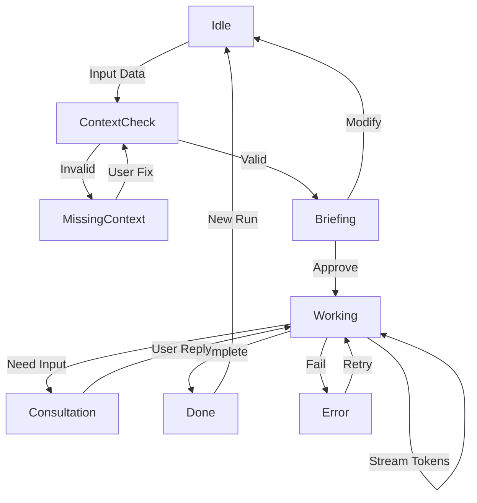

# Agent Lifecycle States (Inspector FSM)

> **Context:** Defines the Finite State Machine (FSM) for Agent/Crew execution within the Canvas Inspector.
> **Relation:** Complements `sitemap.md` (Right Panel) and `canvas_state.md`.

## 1. State Diagram Overview

## 2. Detailed State Definitions

### **S.1) Idle (Default)**
*   **Trigger:** Node selected, no active run.
*   **UI:** Shows Agent identity, capabilities, and empty input form.
*   **Actions:** User enters data into `Input Schema` form.

### **S.2) Missing Context (Validation)**
*   **Trigger:** User attempts to run, but `Input Schema` validation fails (Zod schema).
*   **UI:** 
    *   Form fields highlighted in red.
    *   Error messages inline (e.g., "Field 'target_audience' is required").
    *   "Run" button disabled.
*   **Actions:** User corrects form data.

### **S.3) Briefing (Cost & Plan Approval) ★ v3.0 ★**
*   **Trigger:** Inputs valid, "Plan" button clicked.
*   **UI:**
    *   **Proposed Plan:** List of steps the agent/crew will take.
    *   **Cost Estimate:** Calculated based on token input + estimated output (e.g., "~$0.15").
    *   **Tier Warning:** If using Tier 1 model, show "High Performance Mode".
*   **Actions:** 
    *   [Approve & Run] (Primary)
    *   [Edit Context] (Secondary)

### **S.4) Working (Streaming Execution)**
*   **Trigger:** User approves briefing.
*   **UI:**
    *   **Progress:** Indeterminate progress bar (pulsing).
    *   **Streaming Output:** Text appears token-by-token.
    *   **Real-time Metrics:** Timer count up, Token count up.
    *   **Skeleton Loading:** For artifacts being generated.
*   **Actions:** 
    *   [Stop] (Immediate interrupt).

### **S.5) Consultation (Human-in-the-Loop)**
*   **Trigger:** Agent hits a `tool_call` requesting human feedback.
*   **UI:**
    *   Execution pauses.
    *   **Agent Question:** Displayed prominently.
    *   **Input Field:** Textarea for user response.
*   **Actions:** 
    *   [Reply & Resume]
    *   [Cancel Run]

### **S.6) Done (Success)**
*   **Trigger:** Execution finishes successfully.
*   **UI:**
    *   **Summary:** Final cost, time, token usage.
    *   **Output:** Final response with **Citations** `[1]`.
    *   **Artifacts:** List of generated files (Status: `Draft`).
*   **Actions:** 
    *   [View Artifact]
    *   [Download]
    *   [New Run]

### **S.7) Error (Failure & Recovery)**
*   **Trigger:** API Error, Timeout, or Rate Limit.
*   **UI:**
    *   **Error Banner:** Red, descriptive message.
    *   **Fallback Info:** If fallback occurred (e.g., "Switched to Gemini Flash due to rate limit"), show info badge.
    *   **Debug Info:** Collapsible JSON with stack trace.
*   **Actions:** 
    *   [Retry] (Re-send same payload).
    *   [Edit Inputs] (Go back to Idle).
