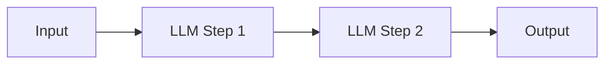
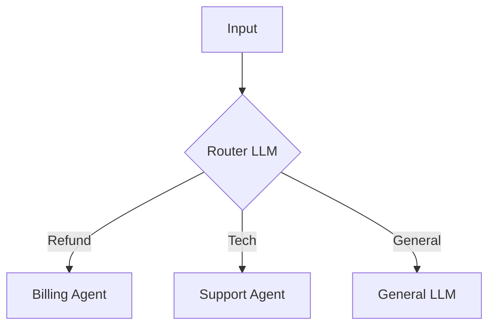
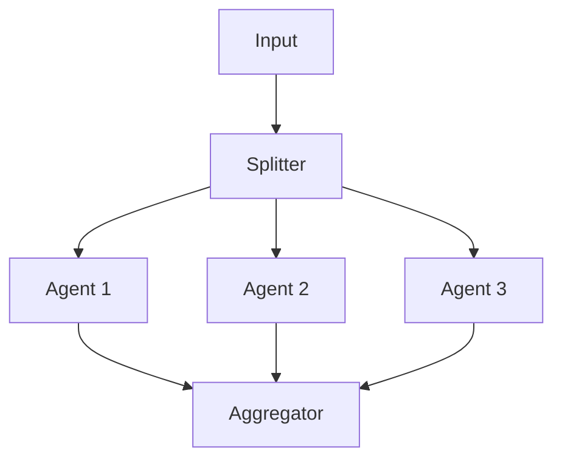
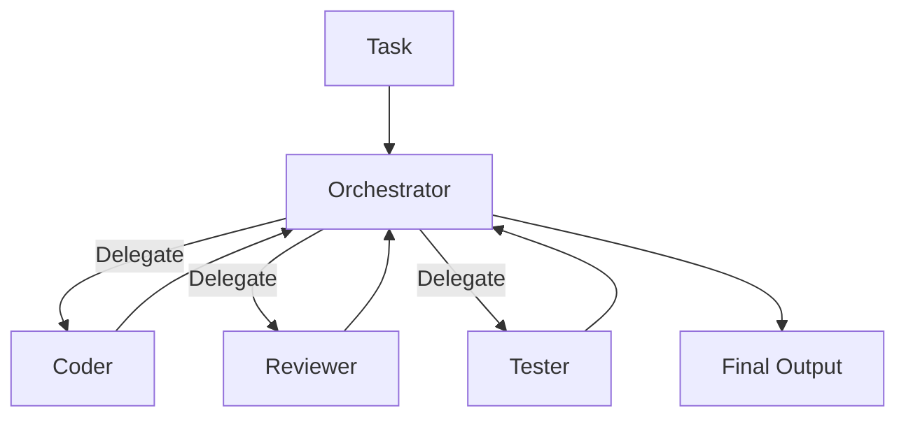
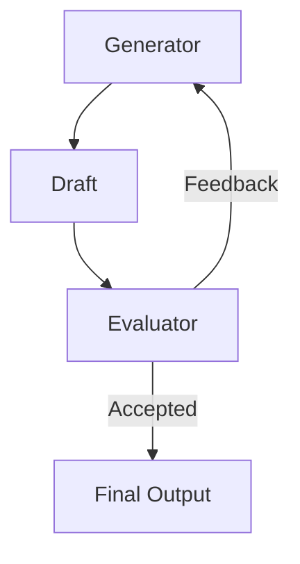

# Agent Architecture Patterns & SOP Protocols

> **Status:** Engineering Standard
> **Domain:** AI Engineering
> **Context:** Budowa skalowalnych, autonomicznych systemów AI.

---

## 1. Fundamenty: Asystent vs Agent

Zanim wybierzesz architekturę, zrozum różnicę w poziomie autonomii.

| Cecha | Asystent (Copilot) | Agent (Autonomous) |
| :--- | :--- | :--- |
| **Pytanie** | Odpowiada na "Jak to zrobić?" | Odpowiada na "Co zrobić?" |
| **Trigger** | Czeka na input człowieka | Może działać w pętli/tle |
| **Decyzyjność** | Niska (część automatyzacji) | Wysoka (Black Box) |
| **Przykład** | Uzupełnianie kodu w IDE | "Zrób research rynku i wyślij raport" |

---

## 2. Wzorce Architektoniczne (Workflow Patterns)

Wybierz wzorzec na podstawie złożoności zadania.

### A. Prompt Chaining (Łańcuch)
Najprostsza forma. Wyjście jednego kroku jest wejściem kolejnego.
**Użycie:** Procesy liniowe, gdzie każdy krok musi być ukończony przed następnym.



### B. Routing (Router)
Klasyfikuje input i kieruje go do wyspecjalizowanego agenta/modelu.
**Użycie:** Obsługa klienta (Refunds vs Tech Support), optymalizacja kosztów (Model Routing).



### C. Parallelization (Równoległość)
Uruchamianie wielu instancji agenta jednocześnie dla różnych danych.
**Użycie:** Przetwarzanie dużej ilości danych (np. analiza 100 stron www jednocześnie), głosowanie (wiele modeli ocenia ten sam input).



### D. Orchestrator-Workers (Orkiestrator)
Centralny LLM ("Boss") dynamicznie dzieli zadania i deleguje je do pod-agentów ("Workers").
**Użycie:** Złożone zadania kodowania (zmiany w wielu plikach), research wieloźródłowy.



### E. Evaluator-Optimizer (Pętla Jakości)
Generowanie odpowiedzi, ocena przez innego agenta, poprawka.
**Użycie:** Tłumaczenia, pisanie kodu, generowanie treści wysokiej jakości.



### F. The Model Router Pattern (Arbitraż Kosztów)
Architektura optymalizacji kosztów, gdzie "Gateway AI" kieruje ruch.
**Problem:** GPT-4o jest za drogi do prostych zadań.
**Rozwiązanie:**
1.  **Static Router:** Reguły oparte na słowach kluczowych (np. jeśli zapytanie zawiera `/report`, wyślij do modelu analitycznego).
2.  **Semantic Router:** Mały model (np. GPT-4o-mini) klasyfikuje trudność zapytania (0-10) lub intencję.
    *   *Simple (Score < 3):* -> Haiku / Flash.
    *   *Complex (Score > 7):* -> Opus / Pro.

### G. Human-in-the-Loop State Machine (Async Control)
Bezpieczny wzorzec dla akcji krytycznych (płatności, masowe e-maile). Proces to nie tylko "pytanie-odpowiedź", ale maszyna stanów z pauzą.

**Stany:**
1.  `DRAFTING` (AI): Generuje propozycję akcji (np. treść maila).
2.  `AWAITING_APPROVAL` (System): Zapisuje stan w bazie, wysyła powiadomienie do człowieka, hibernuje proces.
3.  `APPROVED` (Human): Człowiek klika "Zatwierdź" w UI -> proces wznawia się od tego momentu.
4.  `EXECUTING` (System): Wysłanie maila.

**Klucz:** Wymaga architektury asynchronicznej (kolejki/bazy), nie HTTP request-response.

---

## 3. SOP-Driven Workflow (Operational Excellence)

Metodologia budowania agentów działających jak pracownicy operacyjni.

### Definicja SOP
**SOP (Standard Operating Procedure)** to zestaw atomowych instrukcji, które agent wykonuje sekwencyjnie bez interpretowania kontekstu na nowo.

### Model "Boss & Worker"
W praktyce produkcyjnej stosujemy podział ról modeli:

1.  **Gemini 3 Pro / GPT-4o ("The Boss"):**
    *   **Rola:** High-level reasoning, planowanie.
    *   **Zadanie:** Tworzy plik `instructions.md` (SOP) dla Workera.
    *   **Cechy:** Droższy, wolniejszy, bardzo inteligentny.

2.  **Gemini 2.5 Flash / GPT-4o-mini ("The Worker"):**
    *   **Rola:** Egzekucja, skala.
    *   **Zadanie:** Wykonuje instrukcję linijka po linijce.
    *   **Cechy:** Tani, szybki, uruchamiany w setkach instancji równolegle (CLI).

### Zasady projektowania SOP
1.  **Atomowość:** Jeden krok = jedna akcja ("Wyszukaj", nie "Zanalizuj rynek").
2.  **Zero Interpretacji:** Zamiast "Znajdź ciekawe firmy", napisz "Wybierz top 5 firm wg przychodu".
3.  **Exit Criteria:** Jasne kryterium zakończenia kroku.
4.  **Format Wyjścia:** Zawsze precyzuj format (CSV, JSON, Markdown Table).

### Szablon SOP (Przykład)
```markdown
# SOP: Research Profilu Klienta

1. Wyszukaj w Google 5 firm z branży X w kraju Y.
2. Z każdego wyniku wyciągnij:
   - nazwa firmy
   - opis
   - link
   - kluczowy produkt/usługa
3. Zbuduj tabelę z danymi.
4. Zapisz wynik do CSV w formacie: `Name, Description, URL, Product`.
```

---

## 4. Implementation Reference (Google ADK Style)

Przykłady implementacji wzorców w Pythonie (Google Agent Development Kit).

### Agent Pipeline (Sequential & Parallel)
Przykład łańcucha agentów do raportowania danych.

```python
from google.adk.agents import Agent, SequentialAgent, ParallelAgent
from google.adk.tools.bigquery import BigQueryToolset

MODEL = "gemini-2.5-flash"

# 1. Specialized Agents
bigquery_agent = Agent(
    model=MODEL,
    name="bigquery_agent",
    description="Extracts internal sales data from BigQuery.",
    tools=[BigQueryToolset()],
    output_key="bigquery_output"
)

insight_finder = Agent(
    model=MODEL,
    name="insight_finder",
    description="Finds external market insights via Google Search.",
    instruction="Find news and trends for the brands found in the data.",
    tools=[google_search],
    output_key="insight_output"
)

# 2. Parallel Execution (Gather Data)
data_harvester_agent = ParallelAgent(
    name="data_harvester",
    sub_agents=[bigquery_agent, insight_finder],
    description="Gathers internal and external data simultaneously."
)

# 3. Synthesis Agent
report_builder = Agent(
    model=MODEL,
    name="report_builder",
    description="Synthesizes a business report.",
    instruction="Combine internal data {bigquery_output} and external insights {insight_output} into a report."
)

# 4. Sequential Execution (Process Flow)
report_generator = SequentialAgent(
    name="report_generator",
    sub_agents=[data_harvester_agent, report_builder],
    description="End-to-end report generation pipeline."
)
```

### Agent Loop (Evaluator-Optimizer)
Przykład pętli ulepszania dokumentu.

```python
from google.adk.agents import LlmAgent, LoopAgent

COMPLETION_PHRASE = "DOCUMENT_IS_PERFECT"

# 1. Critic Agent
critic_agent = Agent(
    model="gemini-2.5-flash",
    name="CriticAgent",
    instruction=f"""Analyze the document. 
    If perfect, output ONLY: "{COMPLETION_PHRASE}".
    Else, provide critique in **Critique/Suggestions** section.""",
    output_key="criticism"
)

# 2. Refiner Agent (with Exit Tool)
def exit_loop(tool_context):
    tool_context.actions.escalate = True # Break the loop
    return {}

refiner_agent = LlmAgent(
    name="RefinerAgent",
    instruction=f"""Refine the document based on critique.
    IF critique is "{COMPLETION_PHRASE}": Call `exit_loop`.
    ELSE: Output refined text.""",
    tools=[exit_loop],
    output_key="current_document"
)

# 3. Loop Construction
refinement_loop = LoopAgent(
    name="RefinementLoop",
    sub_agents=[critic_agent, refiner_agent],
    max_iterations=5
)
```
