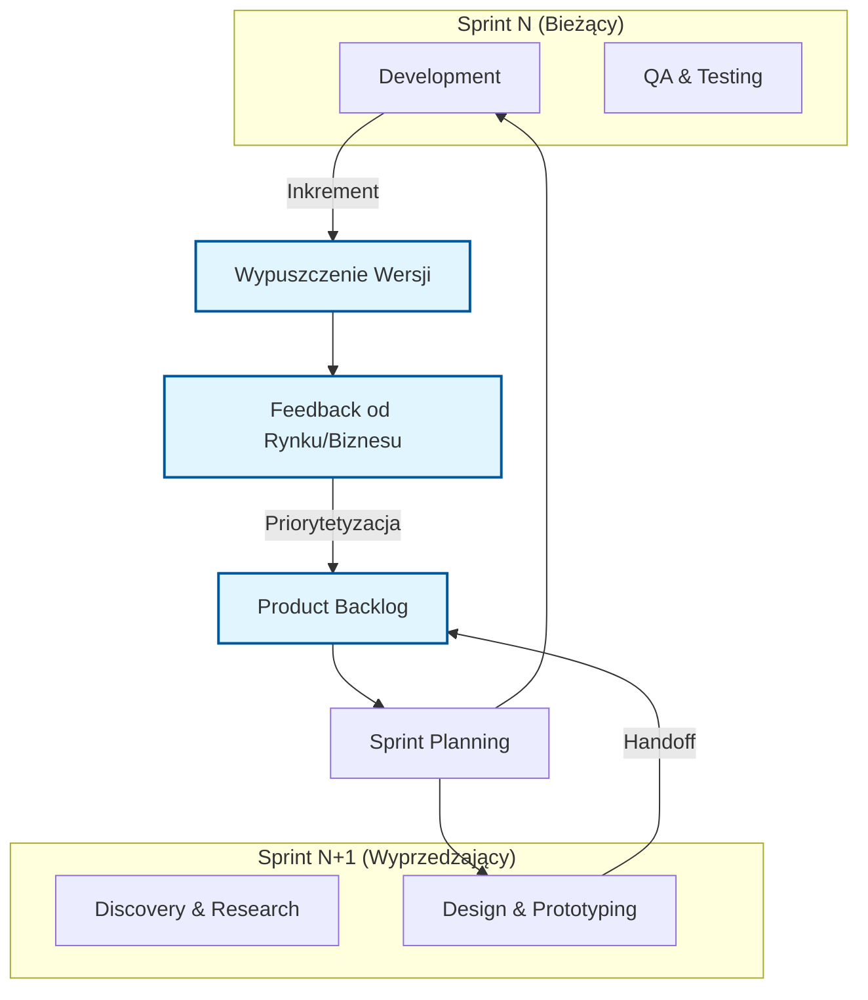
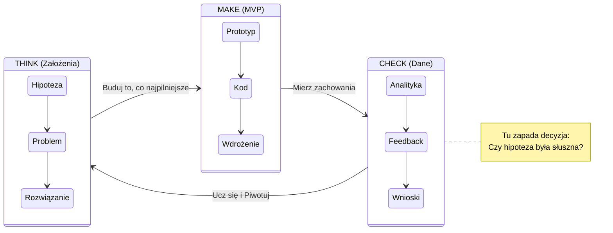

# Agile UX & Lean UX: Metodologia Pracy

> **Context:** Fundament teoretyczny dla współpracy Product Designera z zespołami Deweloperskimi.
> **Źródło:** Raw/agile-ux, Raw/lean-ux

---

## 1. Agile UX (Zwinne Projektowanie)

**Definicja:** Synchronizacja pracy projektantów UX z zespołami deweloperskimi (Scrum), aby iteracyjnie dostarczać wartość. Nie projektujemy "wielkiego planu" na rok, tylko funkcje na najbliższy sprint + 1.

### 🔄 Schemat Procesu (The Agile UX Loop)

Ten diagram odzwierciedla cykl opisany w materiałach źródłowych: synchronizacja, równoległa praca i feedback.

### Kluczowe Zasady
*   **Iteracyjność:** Produkt powstaje w kawałkach (Features).
*   **Współpraca:** UX jest częścią zespołu Agile (Stand-ups, Retro), a nie "zewnętrzną agencją".
*   **Just-in-Time:** Projektujemy to, co będzie kodowane zaraz, a nie za pół roku.
*   **Zero Waste:** Minimalizacja dokumentacji ("Działający soft > Obszerna dokumentacja").

---

## 2. Lean UX (Odchudzone Projektowanie)

**Definicja:** Podejście skupione na **wyniku (Outcome)**, a nie na dostarczaniu dokumentacji (Output). Łączy Design Thinking z filozofią Lean Startup.

### ♻️ Cykl: Think - Make - Check

Podstawowy schemat myślowy Lean UX (bazujący na "Build-Measure-Learn").

### Fundamenty Lean UX
1.  **Hipotezy zamiast Wymagań:** Traktujemy pomysły jako założenia do sprawdzenia, a nie fakty.
2.  **MVP (Minimum Viable Product):** Najmniejsza rzecz, którą możemy zbudować, by się czegoś nauczyć.
3.  **Cross-functional:** Biznes, Design i Tech pracują razem od dnia zero (rozwiązywanie sporów przez wspólną wizję).

---

## ⚔️ Porównanie: Agile UX vs Lean UX

| Cecha | Agile UX | Lean UX |
| :--- | :--- | :--- |
| **Główny cel** | Integracja UX z rytmem pracy Devów (Scrum). | Eliminacja marnotrawstwa i szybka weryfikacja. |
| **Podejście** | "Jak to zbudować w sprincie?" | "Czy w ogóle powinniśmy to budować?" |
| **Artefakty** | Makiety, Flowy (dostarczane do Dev). | Hipotezy, Eksperymenty, Wnioski. |
| **Wspólny mianownik** | **Brak wielkiej dokumentacji** + **Ciągły Feedback**. | |

---

## 🚀 Jak to aplikujemy w Workflow?

1.  **Discovery:** Używamy **Lean UX** do walidacji pomysłów (Assumption Testing w `02. Discovery`).
2.  **Delivery:** Używamy **Agile UX** do dowożenia (Sprinty, Handoff w `04. Delivery`).
3.  **Mentalność:** W każdym dokumencie w Hubach stosujemy zasadę "Minimum Viable Documentation".
